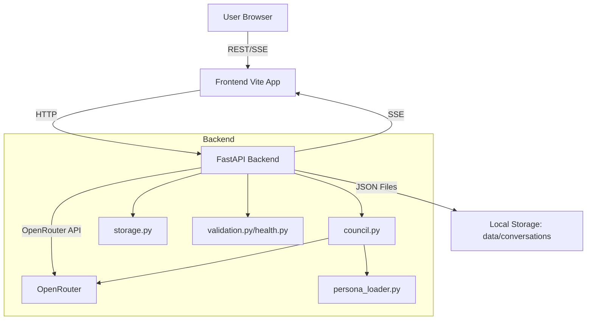
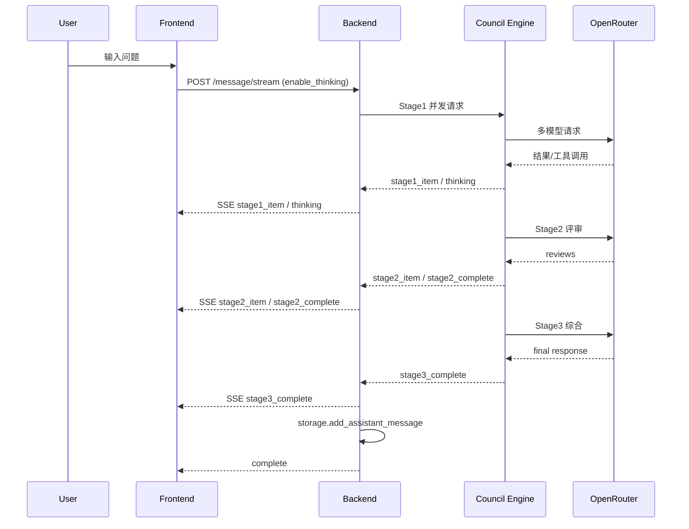

# AGENTS.md - 技术架构与工作流（最新版）

本文件是 LLM Council Sentinel 的权威技术说明文档，覆盖架构、关键流程、数据结构、边界条件与运行规则。
文档内容基于当前代码实现（以 `backend/` 与 `frontend/src/` 为准），用于"给任何人看，都没有歧义"的级别说明。

> **相关文档**
> - [Architecture.md](./Architecture.md) - 系统架构总览
> - [API_REFERENCE.md](./API_REFERENCE.md) - API 接口参考
> - [DATA_SCHEMA.md](./DATA_SCHEMA.md) - 数据模型定义
> - [配置说明.md](./配置说明.md) - 环境配置指南

---

## 1. 系统概览

LLM Council 是一个三阶段异步协作系统：
- **Stage1**：多名 Councilor 并行产出观点与 judge_card
- **Stage2**：匿名互评与排序
- **Stage3**：Chairman 综合输出最终结论

系统具备：
- 模型健康管理（健康/冷却/不可用）
- 对话持久化（JSON 文件）
- 流式 SSE 输出（前端实时渲染）
- 可选 Thinking 工具调用（前端显示 Console 与头像历史）

---

## 2. 架构与模块

### 2.1 后端模块（`backend/`）

| 模块 | 作用 | 关键职责 |
|---|---|---|
| `main.py` | FastAPI 入口 | API 路由、流式 SSE、对话存储、rate limit、输入校验、健康刷新调度 |
| `council.py` | 三阶段编排 | Stage1/2/3 执行、并发控制、重试策略、匿名映射、thinking 注入 |
| `openrouter.py` | LLM 客户端 | 请求 OpenRouter API、解析流式 tool_calls、回调 thinking |
| `storage.py` | 存储层 | JSON 持久化、对话列表、单/批量删除、schema 迁移 |
| `validation.py` / `health.py` | 健康系统 | 健康探测、状态缓存、冷却与失败阈值 |
| `persona_loader.py` | Persona 载入 | 启动预加载 persona，避免每次 I/O |
| `config.py` | 全局配置 | 模型/超时/并发/健康参数/路径配置 |

### 2.2 前端模块（`frontend/src/`）

| 模块 | 作用 | 关键职责 |
|---|---|---|
| `App.jsx` | 应用入口 | 会话加载、流式消息渲染、全局 thinking 状态管理 |
| `ChatInterface.jsx` | 核心 UI | 输入区、Stage1/2/3 渲染、SSE 事件分发、空白态 |
| `CouncilAvatars.jsx` | 成员展示 | 头像状态、不可用列表、thinking 历史展开 |
| `ThinkingConsole.jsx` | 全局 Console | 实时显示思考标题流 |
| `TacticalHUD.jsx` | 战术 HUD | 底部状态栏、Councilor 卡片、共识信号 |
| `api.js` | API 客户端 | 所有 REST/SSE 请求封装 |

---

## 3. Councilor 与模型配置

系统采用 **两级模型配置**：全局模型池 (`GLOBAL_MODEL_POOL`) + Councilor/Chairman 角色定义。

**当前角色**:
- **Councilors**: 康德 (🧠)、特朗普 (🧱)、小岛秀夫 (🎮)
- **Chairman**: 共识主席 (🪶)

**配置结构概览**:
- `model_candidates`: 候选模型列表（按优先级排序，自动回退）
- `persona_path`: Stage1 人设文件路径
- `judge_persona_path`: Stage2 评审人设路径
- `stage_limits`: 阶段级超时与 Token 限制

> **完整配置详情请参见 [配置说明.md](./配置说明.md)**，包含：
> - 模型池字段结构与示例
> - Councilor/Chairman 完整定义
> - 并发与超时参数
> - 健康检查与重试机制

---

## 4. Thinking 工具定义

### 4.1 工具 Schema

```json
{
  "type": "function",
  "function": {
    "name": "emit_thinking",
    "description": "Emit a thinking step payload for UI display.",
    "parameters": {
      "type": "object",
      "properties": {
        "title": {
          "type": "string",
          "description": "Short title of the thinking step"
        },
        "detail": {
          "type": "string",
          "description": "Optional detailed explanation"
        },
        "bullet_id": {
          "type": "string",
          "description": "Unique ID for this thinking bullet (auto-generated if not provided)"
        },
        "op": {
          "type": "string",
          "enum": ["append", "update"],
          "description": "Operation type: append new or update existing"
        }
      },
      "required": ["title"]
    }
  }
}
```

### 4.2 工具调用示例

```json
{
  "name": "emit_thinking",
  "arguments": {
    "title": "分析问题背景",
    "detail": "首先需要理解用户提问的具体语境和期望...",
    "bullet_id": "step-1",
    "op": "append"
  }
}
```

### 4.3 前端接收格式

```json
{
  "type": "thinking",
  "stage": "stage1",
  "councilor_id": "immanuel_kant",
  "model": "xiaomi/mimo-v2-flash:free",
  "bullet_id": "immanuel_kant-stage1-1",
  "title": "分析问题背景",
  "detail": "首先需要理解用户提问的具体语境...",
  "op": "append",
  "t": 1.23
}
```

| 字段 | 类型 | 描述 |
|---|---|---|
| `stage` | string | 当前阶段 (`stage1`/`stage2`/`stage3`) |
| `councilor_id` | string | 发出 Thinking 的 Councilor ID |
| `model` | string | 使用的模型 ID |
| `bullet_id` | string | Thinking 条目唯一 ID |
| `title` | string | Thinking 标题 |
| `detail` | string | Thinking 详情 (可选) |
| `op` | string | 操作类型 (`append`/`update`) |
| `t` | number | 相对时间戳 (秒，从请求开始计) |

**注意**：Thinking 事件现已持久化到 `metadata.thinking` 中，但有数量限制（每 Councilor/阶段 50 条，总计 200 条）。

---

## 5. 技术架构图



---

## 6. 数据与协议（无歧义定义）

### 6.1 Conversation JSON Schema（文件存储）
**文件路径**：`data/conversations/{conversation_id}.json`

```json
{
  "id": "<uuid>",
  "created_at": "<iso8601>",
  "title": "<string>",
  "messages": [
    { "role": "user", "content": "<string>" },
    {
      "role": "assistant",
      "stage1": [ { ...stage1_item } ],
      "stage2": { ...stage2_result },
      "stage3": { ...stage3_result },
      "metadata": {
        "anon_to_councilor": { "anon_1": "councilor_id" },
        "aggregate_rankings": [ { "councilor_id": "...", "average_rank": 1.5, "rankings_count": 3 } ],
        "spec_version": "stage2_v1.2",
        "thinking": { "stage1": {...}, "stage2": {...}, "stage3": {...} }
      }
    }
  ],
  "active_models": null,
  "active_councilor_ids": ["id1", "id2"],
  "active_chairman": "chairman_id",
  "schema_version": 2
}
```

**说明**：
- 流式与非流式均会保存完整 `assistant` 消息。
- `metadata.thinking` 现已包含 Thinking 步骤日志（有数量限制）。

> 详细字段说明参见 [DATA_SCHEMA.md](./DATA_SCHEMA.md)

### 6.2 Stage1 Result 结构
```json
{
  "councilor_id": "...",
  "councilor_name": "...",
  "model": "...",
  "status": "ok|failed",
  "answer_markdown": "...",
  "answer_summary": "...",
  "judge_card": {
    "stance": "...",
    "core_reasons": ["..."],
    "assumptions": ["..."],
    "risks": ["..."],
    "actionables": ["..."]
  },
  "attempted_models": ["..."],
  "fallback_used": true
}
```

### 6.3 Stage2 Result 结构
```json
{
  "skipped": false,
  "skipped_reason": null,
  "reviews": [
    {
      "judge_councilor_id": "...",
      "judge_councilor_name": "...",
      "model": "...",
      "ranking": ["anon_1", "anon_2"],
      "scores": {"anon_1": 8, "anon_2": 6},
      "rationale": "..."
    }
  ],
  "anon_map": {"anon_1": "c1", "anon_2": "c2"},
  "judge_failures": []
}
```

### 6.4 Stage3 Result 结构
```json
{
  "status": "ok|failed",
  "model": "...",
  "response": "<markdown>",
  "attempted_models": ["..."],
  "fallback_used": false
}
```

---

## 7. API 与 SSE 事件协议

### 7.1 REST API

| 方法 | 路径 | 描述 | 认证 | Rate Limit |
|---|---|---|---|---|
| `GET` | `/api/councilors?refresh=<bool>` | 获取 Councilor 列表 | 否 | — |
| `POST` | `/api/conversations` | 创建新对话 | 否 | — |
| `GET` | `/api/conversations` | 获取对话列表 | 否 | — |
| `GET` | `/api/conversations/{id}` | 获取单个对话 | 否 | — |
| `POST` | `/api/conversations/{id}/message` | 发送消息 (同步) | 否 | 5/min |
| `POST` | `/api/conversations/{id}/message/stream` | 发送消息 (流式) | 否 | 5/min |
| `DELETE` | `/api/conversations/{id}` | 删除对话 | **X-Admin-Token** | — |
| `POST` | `/api/conversations/bulk-delete` | 批量删除 | **X-Admin-Token** | — |

> 完整 API 文档参见 [API_REFERENCE.md](./API_REFERENCE.md)

### 7.2 SSE 事件流（`/message/stream`）

**事件序列**：

```
meta → stage1_start → [thinking]* → [stage1_item]* → stage1_complete
     → stage2_start → [thinking]* → [stage2_item]* → stage2_complete
     → stage3_start → [thinking]* → stage3_complete
     → [title_complete] → complete
```

**Thinking 事件**（最新格式）：
```json
{
  "type": "thinking",
  "stage": "stage1|stage2|stage3",
  "councilor_id": "immanuel_kant",
  "model": "xiaomi/mimo-v2-flash:free",
  "bullet_id": "immanuel_kant-stage1-1",
  "title": "分析问题",
  "detail": "...",
  "op": "append|update",
  "t": 1.23
}
```

**其他增量事件**：
- `stage1_answer_delta` / `stage3_answer_delta`：回答文本增量
- `stage1_answer_done`：某 Councilor 回答完成

---

## 8. 三阶段执行流程（技术方案）



**设计要点**：
- Stage1/2/3 均可触发 thinking 工具调用（`enable_thinking` 控制）。
- Stage2 跳过条件：Stage1 有效候选 < 2。
- Stage3 始终执行（除非 Stage1 全失败）。

---

## 9. 并发与超时配置

### 9.1 并发控制参数

| 参数 | 值 | 描述 |
|---|---|---|
| `DEFAULT_CONCURRENCY_STAGE1` | 6 | Stage1 全局并发限制 |
| `DEFAULT_CONCURRENCY_STAGE2` | 4 | Stage2 全局并发限制 |
| 模型级 `concurrency_limit` | 3-5 | 每个模型的最大并发请求数 |

### 9.2 超时配置

| 参数 | 值 | 描述 |
|---|---|---|
| `DEFAULT_STAGE1_TIMEOUT` | 120.0s | Stage1 单次请求超时 |
| `DEFAULT_STAGE2_TIMEOUT` | 180.0s | Stage2 单次请求超时 |
| Stage3 Timeout | 90.0s | Chairman 综合请求超时 |
| `STAGE1_DEADLINE` | None | Stage1 整体截止时间（禁用） |
| `STAGE2_DEADLINE` | None | Stage2 整体截止时间（禁用） |

---

## 10. Health 与路由规则

### 10.1 健康管理参数

| 参数 | 值 | 描述 |
|---|---|---|
| `HEALTH_TTL_SECONDS` | 3600 | 健康状态缓存有效期 (1 小时) |
| `REFRESH_COOLDOWN_SECONDS` | 60 | 刷新冷却期 (避免频繁探测) |
| `FAILURE_THRESHOLD` | 2 | 连续失败次数阈值 (触发冷却) |
| `BACKOFF_SECONDS` | [120, 300, 900, 3600] | 冷却时间梯度 (秒) |
| `PROBE_TIMEOUT_SECONDS` | 25.0 | 健康探测超时 |
| `HEALTH_PROBE_CONCURRENCY` | 4 | 健康探测并发数 |
| `HEALTH_STARTUP_CHECK` | False | 启动时是否执行健康检查 |

### 10.2 硬错误定义

立即标记模型为不可用的错误码和模式：

**错误码**: `401`, `403`, `404`

**错误模式**:
- `"does not exist"`
- `"not found"`
- `"permission denied"`
- `"unauthorized"`
- `"disabled"`

### 10.3 模型健康状态

| 状态 | 描述 | `healthy` 值 |
|---|---|---|
| `unknown` | 未探测 | `False` |
| `healthy` | 健康可用 | `True` |
| `unhealthy` | 探测失败 | `False` |
| `cooldown` | 冷却中 | `False` |

### 10.4 路由优先级

1. request payload `councilor_ids` (临时覆盖)
2. conversation 记录的 `active_councilor_ids` (会话级)
3. 当前健康的默认 councilors (全局)

**严格过滤**：任何不健康 ID 都会被忽略并列入 `ignored_ids`。

### 10.5 模型选择与回退 (Resilience)

Councilor 定义中包含 `model` (首选) 和 `model_candidates` (备选列表)。

**选择逻辑**：
1. 检查 `model` 是否健康 (`healthy=True`)。
2. 若健康，直接使用。
3. 若不健康，按序遍历 `model_candidates`。
4. 选中第一个健康的 candidate 作为本次请求的执行模型。
5. 若所有 candidate 均不可用，该 councilor 标记为不可用 (Ignored)。

此机制确保单个模型 API 故障不会瘫痪整个系统。

---

## 11. 前端状态与 UI 策略

### 11.1 关键状态

| 状态 | 类型 | 描述 |
|---|---|---|
| `activeThinking` | `{ [id]: { title, history[] } }` | 当前活跃的 Thinking 状态 |
| `enableThinking` | `boolean` | 是否启用 Thinking (默认 true) |
| `currentConversation` | `Conversation` | 当前对话对象 |
| `councilors` | `Councilor[]` | 已加载的 Councilor 列表 |
| `chairman` | `Councilor` | Chairman 信息 |

### 11.2 核心组件职责

| 组件 | 职责 |
|---|---|
| `ChatInterface.jsx` | SSE 事件分发、Stage 渲染协调、消息发送 |
| `Stage1.jsx` | 渲染 Councilor 观点卡片 |
| `Stage2.jsx` | 渲染匿名互评与排名结果 |
| `Stage3.jsx` | 渲染 Chairman 最终综合 |
| `TacticalHUD.jsx` | 底部状态栏、Councilor 状态卡片 |
| `ThinkingConsole.jsx` | 实时显示 Thinking 标题流 |
| `CouncilAvatars.jsx` | 头像展示、`ThinkingHistory` 弹层 |

### 11.3 已知行为差异（现状）

- empty state 输入区 **没有** thinking toggle。
- thinking 历史显示依赖 `CouncilAvatars` 中的 `ThinkingHistory` 弹层。

---

## 12. 运行与运维要点

- **流式消息必存储**：`send_message_stream` 已写入 `storage.add_assistant_message`。
- **thinking 已持久化**：`metadata.thinking` 包含 Thinking 步骤（有数量限制）。
- **删除保护**：`verify_admin` 当前默认放行（debug）。**生产必须启用真实 token 校验**。
- **定时健康刷新**：后台任务每 `HEALTH_TTL_SECONDS` (3600s) 执行一次全局健康刷新。

---

## 13. 常见问题排查

| 问题 | 排查步骤 |
|---|---|
| **刷新后无消息** | 检查是否使用 streaming 且后端保存成功 |
| **Console 无标题** | 确认 `enable_thinking=true`；确认模型支持 thinking |
| **Stage2 被跳过** | 检查 Stage1 有效结果是否 < 2 |
| **所有 Councilor 不可用** | 检查健康状态；手动刷新 (`?refresh=true`) |
| **模型返回错误** | 检查 OpenRouter API Key；查看后端日志 |
| **Rate Limit 触发** | 等待 60 秒后重试 |

---

## 14. 附录：快速参考

### 14.1 环境变量

| 变量 | 必填 | 描述 |
|---|---|---|
| `OPENROUTER_API_KEY` | 是 | OpenRouter API 密钥 |
| `ADMIN_TOKEN` | 否 | 管理员令牌 (默认 `secret-token`) |

### 14.2 启动命令

```bash
# 后端
cd backend && uvicorn main:app --host 0.0.0.0 --port 8000

# 前端
cd frontend && npm run dev

# Docker
docker-compose up -d
```

### 14.3 文档索引

| 文档 | 路径 | 描述 |
|---|---|---|
| 系统架构 | `docs/Architecture.md` | 架构图、技术栈、部署 |
| API 参考 | `docs/API_REFERENCE.md` | REST 接口、SSE 事件 |
| 数据模型 | `docs/DATA_SCHEMA.md` | 数据结构、字段说明 |
| 配置说明 | `docs/配置说明.md` | 环境变量、配置文件 |
| UI 样式指南 | `docs/UI_STYLE_GUIDE.md` | 前端样式规范 |

---

*Last updated: 2026-01-01*

