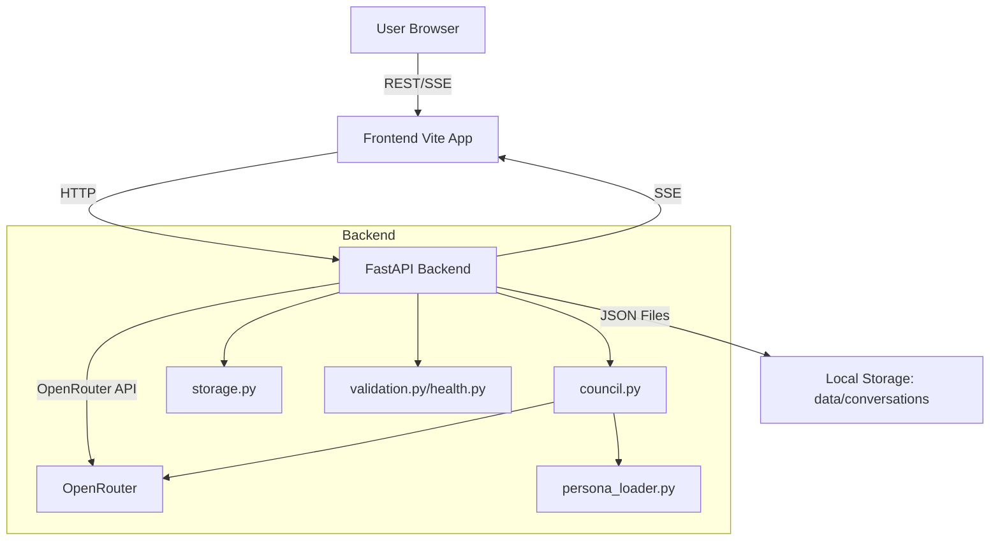
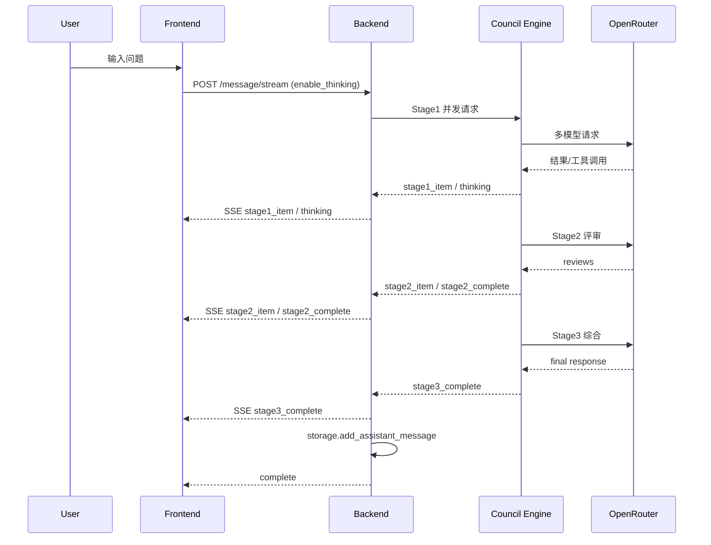

# AGENTS.md - 技术架构与工作流（最新版）

本文件是 LLM Council Sentinel 的权威技术说明文档，覆盖架构、关键流程、数据结构、边界条件与运行规则。
文档内容基于当前代码实现（以 `backend/` 与 `frontend/src/` 为准），用于“给任何人看，都没有歧义”的级别说明。

---

## 1. 系统概览

LLM Council 是一个三阶段异步协作系统：
- **Stage1**：多名 Councilor 并行产出观点与 judge_card
- **Stage2**：匿名互评与排序
- **Stage3**：Chairman 综合输出最终结论

系统具备：
- 模型健康管理（健康/冷却/不可用）
- 对话持久化（JSON 文件）
- 流式 SSE 输出（前端实时渲染）
- 可选 Thinking 工具调用（前端显示 Console 与头像历史）

---

## 2. 架构与模块

### 2.1 后端模块（`backend/`）

| 模块 | 作用 | 关键职责 |
|---|---|---|
| `main.py` | FastAPI 入口 | API 路由、流式 SSE、对话存储、rate limit、输入校验、健康刷新调度 |
| `council.py` | 三阶段编排 | Stage1/2/3 执行、并发控制、重试策略、匿名映射、thinking 注入 |
| `openrouter.py` | LLM 客户端 | 请求 OpenRouter API、解析流式 tool_calls、回调 thinking |
| `storage.py` | 存储层 | JSON 持久化、对话列表、单/批量删除、schema 迁移 |
| `validation.py` / `health.py` | 健康系统 | 健康探测、状态缓存、冷却与失败阈值 |
| `persona_loader.py` | Persona 载入 | 启动预加载 persona，避免每次 I/O |
| `config.py` | 全局配置 | 模型/超时/并发/健康参数/路径配置 |

### 2.2 前端模块（`frontend/src/`）

| 模块 | 作用 | 关键职责 |
|---|---|---|
| `App.jsx` | 应用入口 | 会话加载、流式消息渲染、全局 thinking 状态管理 |
| `ChatInterface.jsx` | 核心 UI | 输入区、Stage1/2/3 渲染、SSE 事件分发、空白态 |
| `CouncilAvatars.jsx` | 成员展示 | 头像状态、不可用列表、thinking 历史展开 |
| `ThinkingConsole.jsx` | 全局 Console | 实时显示思考标题流 |
| `api.js` | API 客户端 | 所有 REST/SSE 请求封装 |

---

## 3. 技术架构图



---

## 4. 数据与协议（无歧义定义）

### 4.1 Conversation JSON Schema（文件存储）
**文件路径**：`data/conversations/{conversation_id}.json`

```json
{
  "id": "<uuid>",
  "created_at": "<iso8601>",
  "title": "<string>",
  "messages": [
    { "role": "user", "content": "<string>" },
    {
      "role": "assistant",
      "stage1": [ { ...stage1_item } ],
      "stage2": { ...stage2_result },
      "stage3": { ...stage3_result },
      "metadata": {
        "anon_to_councilor": { "anon_1": "councilor_id" },
        "aggregate_rankings": [ { "councilor_id": "...", "average_rank": 1.5, "rankings_count": 3 } ],
        "spec_version": "stage2_v1.2"
      }
    }
  ],
  "active_models": null,
  "active_councilor_ids": ["id1", "id2"],
  "active_chairman": "chairman_id",
  "schema_version": 2
}
```

**说明**：
- 流式与非流式均会保存完整 `assistant` 消息。
- `metadata` 不包含 thinking title（按当前需求）。

### 4.2 Stage1 Result 结构
```json
{
  "councilor_id": "...",
  "councilor_name": "...",
  "model": "...",
  "status": "ok|failed",
  "answer_markdown": "...",
  "answer_summary": "...",
  "judge_card": {
    "stance": "...",
    "core_reasons": ["..."],
    "assumptions": ["..."],
    "risks": ["..."],
    "actionables": ["..."]
  },
  "attempted_models": ["..."],
  "fallback_used": true
}
```

### 4.3 Stage2 Result 结构
```json
{
  "skipped": false,
  "skipped_reason": null,
  "reviews": [
    {
      "judge_councilor_id": "...",
      "judge_councilor_name": "...",
      "model": "...",
      "ranking": ["anon_1", "anon_2"],
      "scores": {"anon_1": 8, "anon_2": 6},
      "rationale": "..."
    }
  ],
  "anon_map": {"anon_1": "c1", "anon_2": "c2"},
  "judge_failures": []
}
```

### 4.4 Stage3 Result 结构
```json
{
  "status": "ok|failed",
  "model": "...",
  "response": "<markdown>",
  "attempted_models": ["..."],
  "fallback_used": false
}
```

---

## 5. API 与 SSE 事件协议

### 5.1 REST API
- `GET /api/councilors?refresh=<bool>`
- `POST /api/conversations`
- `GET /api/conversations`
- `GET /api/conversations/{id}`
- `POST /api/conversations/{id}/message`
- `POST /api/conversations/{id}/message/stream`
- `DELETE /api/conversations/{id}`
- `POST /api/conversations/bulk-delete`

### 5.2 SSE 事件流（`/message/stream`）
**事件序列**：
1. `meta` (包含 `resolved_councilors` 与 `chairman` 信息)
2. `stage1_start` → `stage1_item`* → `stage1_complete`
3. `stage2_start` → `stage2_item`* → `stage2_complete`
4. `stage3_start` → `stage3_complete`
5. `title_complete`（仅首条消息）
6. `complete`

**thinking 事件**：
```json
{
  "type": "thinking",
  "stage": "stage1|stage2|stage3",
  "councilor_id": "...",
  "model": "...",
  "delta": "<title>",
  "is_title": true,
  "t": 1.23
}
```

**注意**：thinking 事件仅用于 UI 实时展示，不持久化。

---

## 6. 三阶段执行流程（技术方案）



**设计要点**：
- Stage1/2 均可触发 thinking 工具调用（enable_thinking 控制）。
- Stage2 跳过条件：Stage1 有效候选 < 2。
- Stage3 始终执行（除非 Stage1 全失败）。

---

## 7. Health 与路由规则

### 7.1 模型健康状态
- `healthy == True` 才可执行
- 失败次数达阈值后进入冷却
- 401/403/404 等硬错误立即标记不可用

### 7.2 路由优先级
1. request payload `councilor_ids`
2. conversation 记录的 `active_councilor_ids`
3. 当前健康的默认 councilors

**严格过滤**：任何不健康 ID 都会被忽略并列入 `ignored_ids`。

### 7.3 模型选择与回退 (Resilience)
Councilor 定义中包含 `model` (首选) 和 `model_candidates` (备选列表)。

**选择逻辑**：
1. 检查 `model` 是否健康 (`healthy=True`)。
2. 若健康，直接使用。
3. 若不健康，按序遍历 `model_candidates`。
4. 选中第一个健康的 candidate 作为本次请求的执行模型。
5. 若所有 candidate 均不可用，该 councilor 标记为不可用 (Ignored)。

此机制确保单个模型 API 故障不会瘫痪整个系统。

---

## 8. 前端状态与 UI 策略

### 8.1 关键状态
- `activeThinking`: { [id]: { title, history[] } }
- `enableThinking`: boolean（默认 true）
- `currentConversation`: 当前对话对象

### 8.2 已知行为差异（现状）
- empty state 输入区 **没有** thinking toggle。
- thinking 历史显示依赖 `CouncilAvatars` 中的 `ThinkingHistory` 弹层。

---

## 9. 运行与运维要点

- **流式消息必存储**：`send_message_stream` 已写入 `storage.add_assistant_message`。
- **thinking title 不持久化**：仅用于实时 UI。
- **删除保护**：`verify_admin` 当前默认放行（debug）。生产必须启用真实 token 校验。

---

## 10. 常见问题排查

1) 刷新后无消息
- 检查是否使用 streaming 且后端保存成功。

2) Console 无标题
- 确认 enable_thinking 为 true
- 确认模型具备 thinking capability

3) Stage2 被跳过
- Stage1 有效结果 < 2

---

*Last updated: 2025-02-XX*
