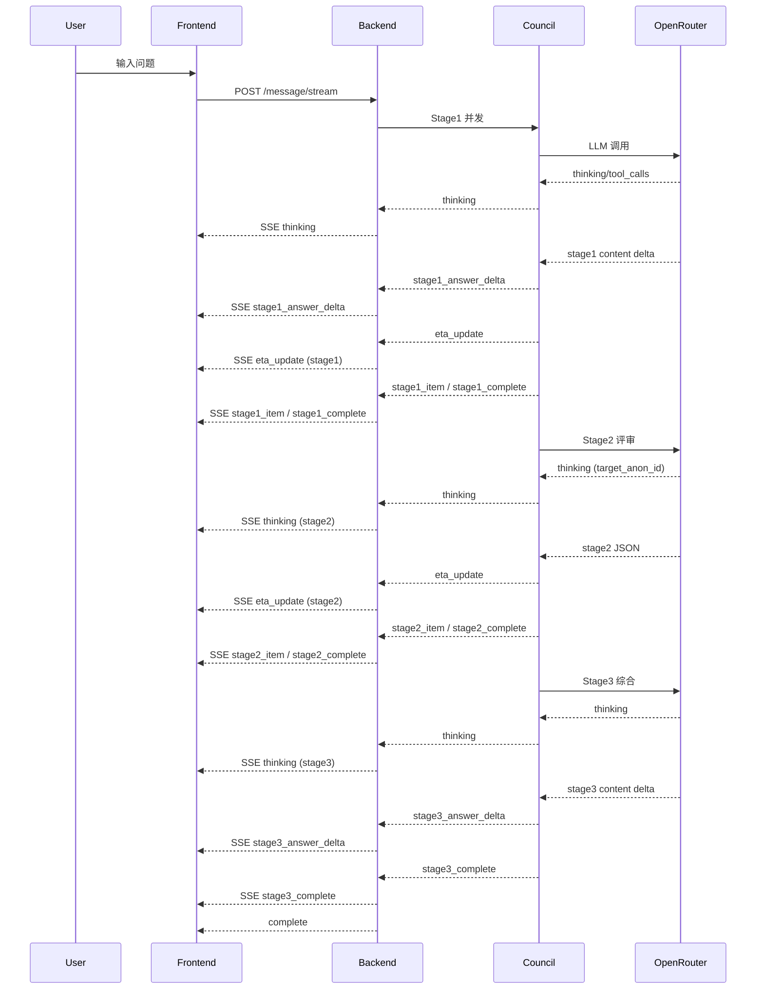

# Architecture.md - LLM Council Sentinel 系统架构总览

本文档提供 LLM Council Sentinel 的架构视图，覆盖组件职责、数据流、技术栈与部署拓扑。

---

## 1. 系统概述

LLM Council Sentinel 是一个多 LLM 协作决策系统，通过三阶段流程实现集体智慧输出：

- **Stage1**：多 Councilor 并行生成回答（Markdown）
- **Stage2**：匿名互评与排序（JSON），并产出 per-candidate 评论
- **Stage3**：Chairman 综合输出最终结论（Markdown）

关键特性：

- **SSE 流式输出**：思考与内容实时推送
- **Thinking 工具**：支持 Stage1/2/3 思考流
- **固定模型分配**：对话创建时分配模型并固定（schema_version=3）
- **健康管理**：模型状态缓存、冷却、自动探测

---

## 2. 高层拓扑

```
┌──────────────────────────────────────────┐
│                User Browser              │
│  React Frontend + SSE Client             │
└──────────────────────────────────────────┘
                    │ REST/SSE
                    ▼
┌──────────────────────────────────────────┐
│          FastAPI Backend (main.py)       │
│  Routes + SSE + Validation + RateLimit   │
└──────────────────────────────────────────┘
                    │
                    ▼
┌──────────────────────────────────────────┐
│          Council Engine (council.py)     │
│  Stage1 → Stage2 → Stage3 orchestration  │
└──────────────────────────────────────────┘
                    │
                    ▼
┌──────────────────────────────────────────┐
│         OpenRouter Client (openrouter.py)│
│  Streaming + Tool Calls + Parsing        │
└──────────────────────────────────────────┘
                    │
                    ▼
┌──────────────────────────────────────────┐
│             OpenRouter API               │
└──────────────────────────────────────────┘

Data Storage: `data/conversations/*.json`
```

---

## 3. 模块职责

### 3.1 后端模块

| 模块 | 作用 | 关键职责 |
|---|---|---|
| `main.py` | FastAPI 入口 | API 路由、SSE、限流、持久化、健康刷新 |
| `council.py` | 编排引擎 | Stage1/2/3 并发执行、匿名映射、Thinking 注入 |
| `openrouter.py` | LLM 客户端 | 流式解析、Tool Calls、Thinking 回调 |
| `runtime_stats.py` | 运行时统计 | TTFT/Generation/Total EMA（按 model+stage） |
| `concurrency_tracker.py` | 并发追踪 | per-model queued/inflight 统计，用于 ETA |
| `model_assigner.py` | 固定分配 | 创建对话时分配模型并持久化 |
| `storage.py` | 存储 | JSON 持久化、对话 CRUD |
| `health.py` / `validation.py` | 健康 | 探测、冷却、健康过滤 |

### 3.2 前端模块

| 模块 | 作用 |
|---|---|
| `App.jsx` | 全局状态 / 路由 / 会话载入 |
| `useParliamentEngine` | SSE 事件分发与状态机 |
| `StageContentArea.jsx` | Stage1/3 内容展示 + Thinking |
| `DetailPanel.jsx` | Stage2 Thinking + Reviews，Stage3 Synthesis |
| `TacticalHUD.jsx` | 进度与状态 HUD |

---

## 4. 核心流程

### 4.1 Stage1

- 多 Councilor 并行请求
- 支持 Thinking 工具与回答增量流
- SSE 事件：`eta_update`、`thinking`、`stage1_answer_delta`、`stage1_item`、`stage1_complete`

### 4.2 Stage2

- 生成匿名候选 `anon_1..n`
- 每个评审员输出排序 JSON（`ranking` + `scores` + `per_candidate_comments`）
- Thinking 事件必须携带 `target_anon_id`，用于 activeTab 过滤
- SSE 事件：`eta_update`、`thinking`、`stage2_item`、`stage2_complete`

### 4.3 Stage3

- 综合 Stage1 + Stage2 结果
- 支持 Thinking 与回答增量流

---

## 5. 数据流（Mermaid）



---

## 6. 部署拓扑

### 6.1 本地开发

- 后端：`uvicorn main:app --port 8010`
- 前端：`npm run dev` (Vite 5173)

### 6.2 Docker + Nginx

- Backend: 8008
- Nginx: 80
- `/api/*` → `backend:8008`

---

*Last updated: 2026-01-03*
