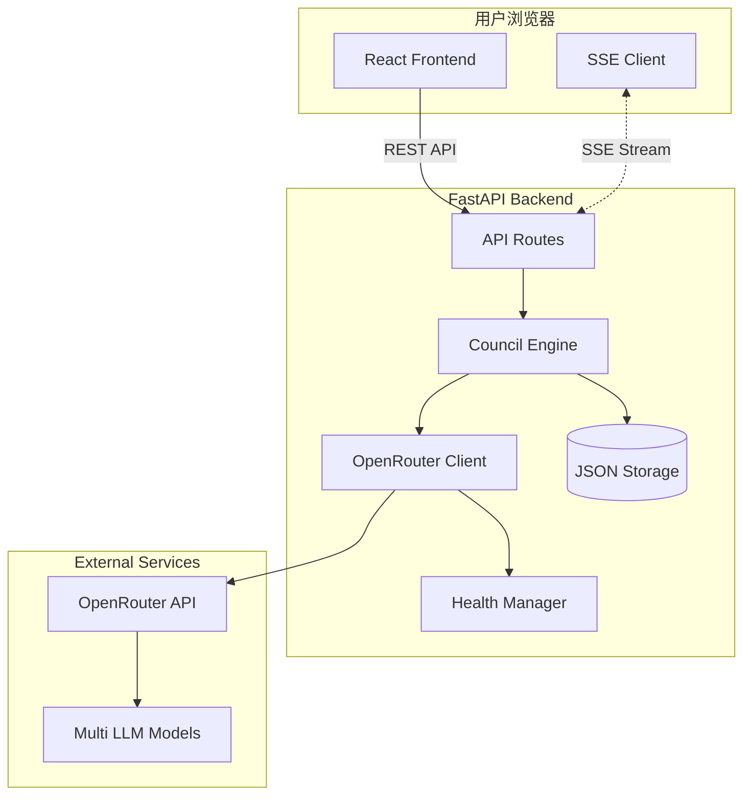
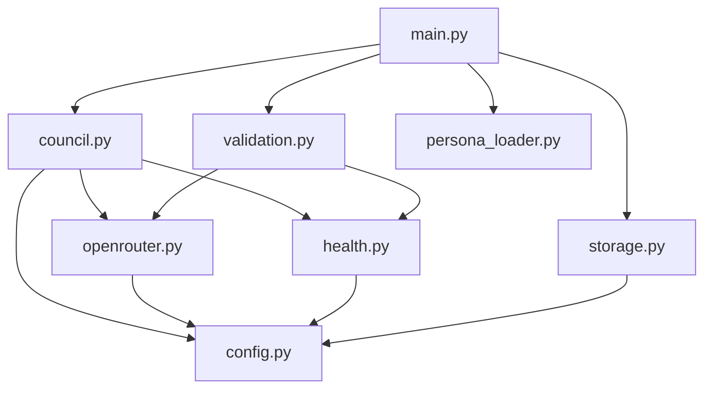
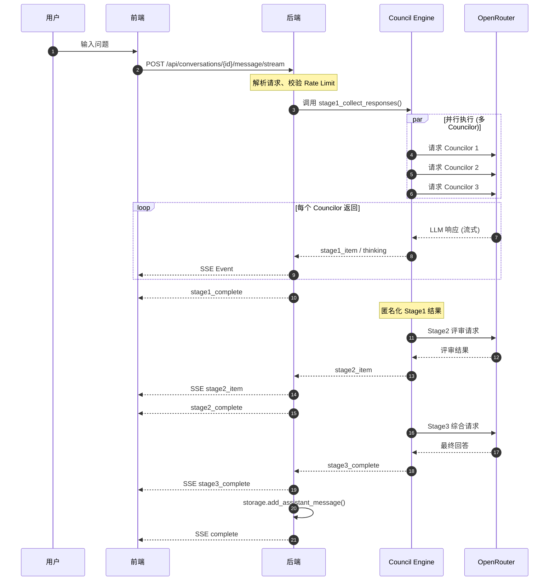
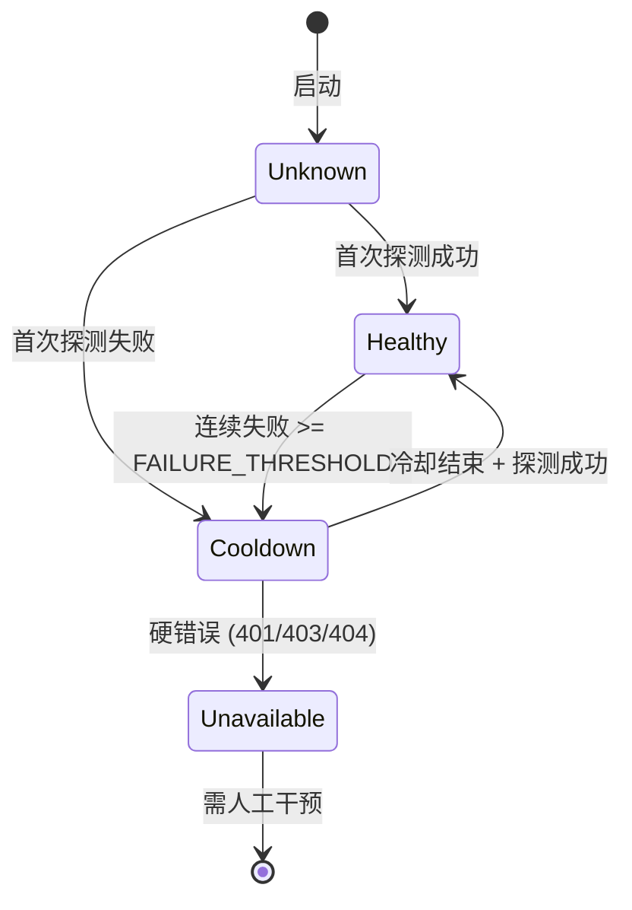

# Architecture.md - LLM Council Sentinel 系统架构总览

本文档提供 LLM Council Sentinel 的全面架构视图，涵盖系统拓扑、组件职责、数据流、技术栈及部署架构。

---

## 1. 系统概述

LLM Council Sentinel 是一个**多 LLM 协作决策系统**，通过三阶段流程（Stage1 观点生成 → Stage2 匿名互评 → Stage3 共识综合）实现多模型集体智慧输出。

### 1.1 核心特性

| 特性 | 说明 |
|---|---|
| **多模型并行** | 多个 Councilor（顾问）同时基于不同 LLM 生成观点 |
| **匿名互评** | Stage2 所有观点匿名化后互相评分排序 |
| **流式输出** | SSE 实时推送思考过程与结果 |
| **健康管理** | 模型健康探测、冷却、自动降级 |
| **持久化存储** | JSON 文件存储对话历史 |

---

## 2. 系统架构图

### 2.1 高层架构 (ASCII)

```
┌─────────────────────────────────────────────────────────────────────────────────┐
│                              用户浏览器 (User Browser)                           │
│  ┌─────────────────────┐   ┌─────────────────────┐   ┌─────────────────────┐    │
│  │    输入区域         │   │   Stage 渲染区域     │   │   Thinking Console │    │
│  │   (ChatInterface)   │   │  (Stage1/2/3.jsx)   │   │  (实时思考展示)     │    │
│  └─────────────────────┘   └─────────────────────┘   └─────────────────────┘    │
└─────────────────────────────────────────────────────────────────────────────────┘
                                        │
                                        │ HTTP REST / SSE
                                        ▼
┌─────────────────────────────────────────────────────────────────────────────────┐
│                              FastAPI Backend (main.py)                          │
│  ┌──────────────┐  ┌──────────────┐  ┌──────────────┐  ┌──────────────┐        │
│  │  API Routes  │  │ Rate Limiter │  │  Validation  │  │  SSE Engine  │        │
│  └──────────────┘  └──────────────┘  └──────────────┘  └──────────────┘        │
│           │                                                    │                │
│           ▼                                                    │                │
│  ┌────────────────────────────────────────────────────────────────────────┐    │
│  │                        Council Engine (council.py)                      │    │
│  │  ┌──────────┐  ┌──────────┐  ┌──────────┐  ┌────────────────────────┐  │    │
│  │  │  Stage1  │→ │  Stage2  │→ │  Stage3  │  │  Thinking Tool Handler │  │    │
│  │  │ (并行)   │  │ (匿名)   │  │ (综合)   │  │  (emit_thinking)       │  │    │
│  │  └──────────┘  └──────────┘  └──────────┘  └────────────────────────┘  │    │
│  └────────────────────────────────────────────────────────────────────────┘    │
│           │                                                                     │
│           ▼                                                                     │
│  ┌──────────────────────────────────────────────────────────────────────────┐  │
│  │                        OpenRouter Client (openrouter.py)                  │  │
│  │  ┌─────────────────┐  ┌─────────────────┐  ┌─────────────────────────┐   │  │
│  │  │  Stream Model   │  │  Tool Calls     │  │  Content Parsing        │   │  │
│  │  │  (SSE 流式)     │  │  Handler        │  │  (JSON/Markdown)        │   │  │
│  │  └─────────────────┘  └─────────────────┘  └─────────────────────────┘   │  │
│  └──────────────────────────────────────────────────────────────────────────┘  │
│           │                                  │                                  │
│           ▼                                  ▼                                  │
│  ┌──────────────────┐               ┌──────────────────────────────────────┐   │
│  │ Storage (JSON)   │               │      Health Manager (health.py)      │   │
│  │ data/conversations│              │  ┌────────────┐  ┌────────────────┐  │   │
│  │ /*.json          │               │  │ 健康探测   │  │ 冷却/降级      │  │   │
│  └──────────────────┘               │  └────────────┘  └────────────────┘  │   │
│                                      └──────────────────────────────────────┘   │
└─────────────────────────────────────────────────────────────────────────────────┘
                                        │
                                        │ HTTPS API Calls
                                        ▼
┌─────────────────────────────────────────────────────────────────────────────────┐
│                           OpenRouter API (External)                             │
│  ┌────────────────────────────────────────────────────────────────────────┐    │
│  │   Multiple LLM Models (Mimo, Nemotron, TNG-R1T-Chimera, etc.)           │    │
│  └────────────────────────────────────────────────────────────────────────┘    │
└─────────────────────────────────────────────────────────────────────────────────┘
```

### 2.2 Mermaid 架构图



---

## 3. 后端模块架构

### 3.1 模块依赖关系



### 3.2 模块职责表

| 模块 | 文件 | 核心职责 | 主要函数/类 |
|---|---|---|---|
| **API 入口** | `main.py` | FastAPI 应用、路由定义、SSE 流、Rate Limit、输入校验 | `send_message_stream()`, `get_councilors()`, `create_conversation()` |
| **Council 编排** | `council.py` | 三阶段执行、并发控制、重试策略、匿名映射、Thinking 注入 | `stage1_collect_responses()`, `stage2_rank_candidates()`, `stage3_final_synthesis()` |
| **LLM 客户端** | `openrouter.py` | OpenRouter API 调用、流式解析、Tool Calls 处理 | `stream_model()`, `query_model()`, `query_models_parallel()` |
| **存储层** | `storage.py` | 对话 JSON 持久化、CRUD 操作、Schema 迁移 | `create_conversation()`, `add_assistant_message()`, `delete_conversation()` |
| **健康管理** | `health.py` | 模型健康状态追踪、冷却机制、探测调度 | `HealthManager`, `HealthRecord`, `update_status()`, `probe_model()` |
| **配置中心** | `config.py` | 全局配置：模型池、超时、并发、健康参数 | `GLOBAL_MODEL_POOL`, `COUNCILORS`, `CHAIRMAN`, `HEALTH_TTL_SECONDS` |
| **健康校验** | `validation.py` | 封装健康探测逻辑、Chairman 选择 | `refresh_council_health()`, `get_council_health_status()` |
| **Persona 加载** | `persona_loader.py` | 预加载 Persona 文本到内存 | `preload_personas()` |

### 3.3 关键数据结构

#### Councilor 定义 (config.py)

```python
{
    "id": "immanuel_kant",           # 唯一标识符
    "name": "康德",                   # 显示名称
    "model": "xiaomi/mimo-v2-flash:free",        # 首选模型
    "model_candidates": [             # 备选模型列表
        "xiaomi/mimo-v2-flash:free",
        "nvidia/nemotron-nano-9b-v2:free",
        ...
    ],
    "avatar": "🧠",                   # 头像 Emoji
    "persona_path": "backend/personas/immanuel_kant.md",  # Persona 文件
    "judge_persona_path": "backend/personas/immanuel_kant_judge.md",  # Stage2 评审 Persona
    "judge_system_prompt": "...",     # Stage2 系统提示
    "stage_limits": {                 # 阶段限制
        "stage1": {"max_output_tokens": 800, "timeout": 120.0},
        "stage2": {"max_output_tokens": 360, "timeout": 75.0}
    }
}
```

#### Model 定义 (config.py)

```python
{
    "id": "xiaomi/mimo-v2-flash:free",
    "name": "Mimo V2 Flash (Free)",
    "concurrency_limit": 5,           # 并发限制
    "category": "fast",               # 分类：fast / reasoning
    "capabilities": {
        "thinking": True,             # 是否支持 Thinking
        "mode": "standard"            # standard / tool
    }
}
```

---

## 4. 前端模块架构

### 4.1 组件层次结构

```
App.jsx                          # 应用入口、全局状态
├── Sidebar.jsx                  # 左侧对话列表
├── ChatInterface.jsx            # 主聊天界面
│   ├── WelcomeScreen.jsx        # 欢迎空白态
│   ├── StageContentArea.jsx     # Stage 内容渲染容器
│   │   ├── Stage1.jsx           # Stage1 观点卡片
│   │   ├── Stage2.jsx           # Stage2 互评结果
│   │   └── Stage3.jsx           # Stage3 最终共识
│   ├── TacticalHUD.jsx          # 底部战术 HUD
│   │   └── ModelBeads.jsx       # 模型状态珠子
│   ├── ThinkingConsole.jsx      # 实时 Thinking 控制台
│   └── CouncilAvatars.jsx       # Councilor 头像区
│       └── ThinkingHistory.jsx  # 思考历史弹层
├── DetailPanel.jsx              # 右侧详情面板
└── PartnerFooter.jsx            # 底部页脚
```

### 4.2 前端核心组件表

| 组件 | 文件 | 职责 |
|---|---|---|
| **App** | `App.jsx` | 全局状态（对话、Thinking）、路由、API 初始化 |
| **ChatInterface** | `ChatInterface.jsx` | 消息输入、SSE 事件分发、Stage 渲染协调 |
| **Stage1** | `Stage1.jsx` | 渲染 Councilor 观点卡片 |
| **Stage2** | `Stage2.jsx` | 渲染匿名互评与排名结果 |
| **Stage3** | `Stage3.jsx` | 渲染 Chairman 最终综合 |
| **TacticalHUD** | `TacticalHUD.jsx` | 底部状态栏、Councilor 状态、共识信号 |
| **ThinkingConsole** | `ThinkingConsole.jsx` | 实时显示 Thinking 标题流 |
| **CouncilAvatars** | `CouncilAvatars.jsx` | 头像展示、不可用列表、历史弹层 |
| **Sidebar** | `Sidebar.jsx` | 对话列表、新建/删除对话 |

### 4.3 API 客户端 (api.js)

| 函数 | 说明 |
|---|---|
| `fetchCouncilors(refresh)` | 获取 Councilor 列表 |
| `fetchConversations()` | 获取所有对话 |
| `fetchConversation(id)` | 获取单个对话详情 |
| `createConversation(councilorIds)` | 创建新对话 |
| `sendMessage(id, content, councilorIds, enableThinking)` | 发送消息（非流式） |
| `sendMessageStream(id, content, councilorIds, enableThinking, onEvent)` | 发送消息（SSE 流式） |
| `deleteConversation(id)` | 删除对话 |
| `bulkDeleteConversations(ids)` | 批量删除对话 |

---

## 5. 数据流

### 5.1 用户消息处理流程



### 5.2 SSE 事件流时序

```
┌─────────────────────────────────────────────────────────────────────────────────┐
│ 时间轴 ──────────────────────────────────────────────────────────────────────▶  │
│                                                                                 │
│  [meta]──▶[stage1_start]──▶[thinking]──▶[stage1_item]──▶[thinking]──▶           │
│                                                                                 │
│  [stage1_item]──▶[stage1_complete]──▶[stage2_start]──▶[stage2_item]──▶          │
│                                                                                 │
│  [stage2_complete]──▶[stage3_start]──▶[stage3_complete]──▶[title_complete]──▶   │
│                                                                                 │
│  [complete]                                                                     │
└─────────────────────────────────────────────────────────────────────────────────┘
```

---

## 6. 技术栈

### 6.1 后端技术栈

| 层级 | 技术 | 版本 | 用途 |
|---|---|---|---|
| **Web 框架** | FastAPI | 0.100+ | API 路由、SSE、依赖注入 |
| **异步运行时** | asyncio | Python 3.11+ | 异步并发控制 |
| **HTTP 客户端** | httpx | 0.24+ | 异步 HTTP 请求 |
| **Rate Limit** | slowapi | 0.1+ | API 限流 |
| **数据校验** | Pydantic | 2.0+ | 请求/响应模型 |
| **存储** | JSON 文件 | — | 对话持久化 |
| **LLM API** | OpenRouter | — | 多模型统一接入 |

### 6.2 前端技术栈

| 层级 | 技术 | 版本 | 用途 |
|---|---|---|---|
| **UI 框架** | React | 18+ | 组件化 UI |
| **构建工具** | Vite | 5+ | 快速开发/构建 |
| **样式** | CSS Modules | — | 组件级样式隔离 |
| **国际化** | i18next | — | 多语言支持 |
| **API 通信** | Fetch API | — | REST/SSE 请求 |

### 6.3 部署技术栈

| 组件 | 技术 | 用途 |
|---|---|---|
| **容器化** | Docker | 环境隔离 |
| **编排** | docker-compose | 多容器编排 |
| **反向代理** | Nginx | 静态资源、API 代理 |
| **包管理** | uv | Python 依赖管理 |

---

## 7. 部署架构

### 7.1 Docker 部署拓扑

```
┌─────────────────────────────────────────────────────────────────────────────┐
│                           Docker Host                                        │
│  ┌─────────────────────────────────────────────────────────────────────┐    │
│  │                        docker-compose                                │    │
│  │  ┌────────────────┐  ┌────────────────┐  ┌────────────────────────┐ │    │
│  │  │   Nginx:80     │  │  Backend:8000  │  │  Frontend (Build)      │ │    │
│  │  │  (Reverse      │◀─│  (FastAPI)     │  │  (Static Files via     │ │    │
│  │  │   Proxy)       │  │                │  │   Nginx)               │ │    │
│  │  └────────────────┘  └────────────────┘  └────────────────────────┘ │    │
│  │           │                  │                                       │    │
│  │           │                  │                                       │    │
│  │  ┌────────▼──────────────────▼───────────────────────────────────┐  │    │
│  │  │              Shared Volume: data/conversations                 │  │    │
│  │  └────────────────────────────────────────────────────────────────┘  │    │
│  └─────────────────────────────────────────────────────────────────────┘    │
└─────────────────────────────────────────────────────────────────────────────┘
                                        │
                                        │ Port 80
                                        ▼
                               ┌─────────────────┐
                               │   用户浏览器    │
                               └─────────────────┘
```

### 7.2 路由配置 (nginx.conf)

| 路径 | 目标 |
|---|---|
| `/api/*` | `http://backend:8000` |
| `/*` (静态) | `/usr/share/nginx/html` |

---

## 8. 并发与容错

### 8.1 并发控制

```
┌─────────────────────────────────────────────────────────────────────────────┐
│                           并发控制层级                                       │
│                                                                              │
│  ┌─────────────────────────────────────────────────────────────────────┐    │
│  │ 全局阶段并发 (Stage-Level Semaphore)                                 │    │
│  │   Stage1: DEFAULT_CONCURRENCY_STAGE1 = 6                            │    │
│  │   Stage2: DEFAULT_CONCURRENCY_STAGE2 = 4                            │    │
│  └─────────────────────────────────────────────────────────────────────┘    │
│                               │                                              │
│                               ▼                                              │
│  ┌─────────────────────────────────────────────────────────────────────┐    │
│  │ 模型级并发 (Model-Level Semaphore)                                   │    │
│  │   每个模型独立 Semaphore，限制同一模型并发请求数                      │    │
│  │   例：mimo-v2-flash concurrency_limit = 5                           │    │
│  └─────────────────────────────────────────────────────────────────────┘    │
│                               │                                              │
│                               ▼                                              │
│  ┌─────────────────────────────────────────────────────────────────────┐    │
│  │ 请求级超时 (Per-Call Timeout)                                        │    │
│  │   Stage1: 120s  |  Stage2: 180s  |  Stage3: 90s                     │    │
│  └─────────────────────────────────────────────────────────────────────┘    │
└─────────────────────────────────────────────────────────────────────────────┘
```

### 8.2 模型健康与降级



### 8.3 模型回退策略

```
用户请求 → 选择 Councilor
              │
              ▼
         检查首选模型
              │
     ┌────────┴────────┐
     │                 │
  健康 ✓            不健康 ✗
     │                 │
     ▼                 ▼
   使用            遍历 model_candidates
                       │
              ┌────────┴────────┐
              │                 │
           找到健康          全部不健康
              │                 │
              ▼                 ▼
            使用          标记 Councilor 不可用
                          (Ignored)
```

---

## 9. 安全性

### 9.1 API 安全措施

| 措施 | 实现 |
|---|---|
| **Rate Limit** | `slowapi`，5 req/min per IP |
| **输入校验** | Pydantic 模型 + 自定义 Validator |
| **路径遍历防护** | `validate_conversation_id()` 白名单校验 |
| **Admin Token** | `X-Admin-Token` Header 保护删除操作 |
| **CORS** | 仅允许指定 Origin |

### 9.2 环境变量

| 变量 | 用途 | 默认值 |
|---|---|---|
| `OPENROUTER_API_KEY` | OpenRouter API 密钥 | 无 (必填) |
| `ADMIN_TOKEN` | 管理员令牌 | `secret-token` |

---

## 10. 目录结构速览

```
llm_council_sentinel/
├── backend/
│   ├── main.py              # FastAPI 入口
│   ├── council.py           # 三阶段编排
│   ├── openrouter.py        # LLM 客户端
│   ├── storage.py           # JSON 存储
│   ├── health.py            # 健康管理
│   ├── validation.py        # 健康校验
│   ├── config.py            # 全局配置
│   ├── persona_loader.py    # Persona 预加载
│   ├── personas/            # Persona 文本文件
│   └── Dockerfile
├── frontend/
│   ├── src/
│   │   ├── App.jsx
│   │   ├── api.js
│   │   ├── components/
│   │   │   ├── ChatInterface.jsx
│   │   │   ├── Stage1.jsx
│   │   │   ├── Stage2.jsx
│   │   │   ├── Stage3.jsx
│   │   │   ├── TacticalHUD.jsx
│   │   │   ├── ThinkingConsole.jsx
│   │   │   └── ...
│   │   └── i18n.js
│   └── package.json
├── data/
│   └── conversations/       # 对话 JSON 文件
├── docs/                    # 项目文档
├── docker-compose.yml
├── nginx.conf
└── pyproject.toml
```

---

*文档版本: 1.0.0 | 最后更新: 2026-01-01*
