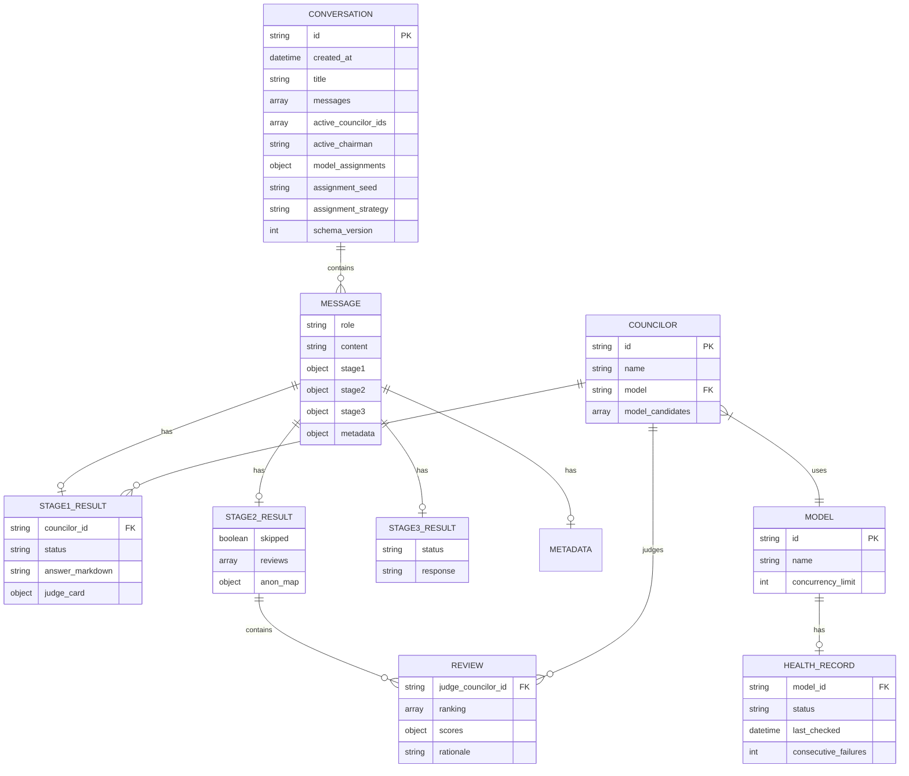

# DATA_SCHEMA.md - LLM Council Sentinel 数据模型文档

本文档定义 LLM Council Sentinel 的核心数据结构、字段说明及数据关系，用于存储层实现和前后端数据交换。

---

## 1. 数据存储概览

### 1.1 存储架构

```
┌─────────────────────────────────────────────────────────────────────────────┐
│                           数据存储架构                                       │
├─────────────────────────────────────────────────────────────────────────────┤
│                                                                             │
│  ┌─────────────────────────────────────────────────────────────────────┐   │
│  │                        文件系统存储                                  │   │
│  │                                                                     │   │
│  │  data/conversations/                                                │   │
│  │  ├── 550e8400-e29b-41d4-a716-446655440000.json                     │   │
│  │  ├── 660e8400-e29b-41d4-a716-446655440001.json                     │   │
│  │  └── ...                                                           │   │
│  │                                                                     │   │
│  │  backend/personas/                                                  │   │
│  │  ├── immanuel_kant.md                                              │   │
│  │  ├── immanuel_kant_judge.md                                        │   │
│  │  ├── donald_trump.md                                               │   │
│  │  └── ...                                                           │   │
│  └─────────────────────────────────────────────────────────────────────┘   │
│                                                                             │
│  ┌─────────────────────────────────────────────────────────────────────┐   │
│  │                        内存缓存                                      │   │
│  │                                                                     │   │
│  │  • ACTIVE_COUNCIL: List[CouncilorStatus]                           │   │
│  │  • ACTIVE_CHAIRMAN: ChairmanStatus                                  │   │
│  │  • PERSONA_CACHE: Dict[str, str]                                    │   │
│  │  • HealthManager._records: Dict[str, HealthRecord]                  │   │
│  └─────────────────────────────────────────────────────────────────────┘   │
│                                                                             │
└─────────────────────────────────────────────────────────────────────────────┘
```

### 1.2 存储路径配置

| 路径 | 描述 | 配置变量 |
|---|---|---|
| `data/conversations/` | 对话 JSON 文件 | `config.DATA_DIR` |
| `backend/personas/` | Persona Markdown 文件 | `councilor.persona_path` |

---

## 2. 核心数据结构

### 2.1 Conversation (对话)

**文件路径**: `data/conversations/{conversation_id}.json`

**Schema 版本**: 3

```json
{
  "id": "550e8400-e29b-41d4-a716-446655440000",
  "created_at": "2026-01-01T10:00:00Z",
  "title": "如何评价AI的发展",
  "messages": [
    { "role": "user", "content": "..." },
    { "role": "assistant", "stage1": [...], "stage2": {...}, "stage3": {...}, "metadata": {...} }
  ],
  "active_models": null,
  "active_councilor_ids": ["immanuel_kant", "donald_trump", "hideo_kojima"],
  "active_chairman": "chairman",
  "model_assignments": {
    "immanuel_kant": "nvidia/nemotron-3-nano-30b-a3b:free",
    "donald_trump": "xiaomi/mimo-v2-flash:free",
    "chairman": "xiaomi/mimo-v2-flash:free"
  },
  "assignment_seed": "2026-01-02T10:22:31Z-3f9a",
  "assignment_strategy": "healthy_first",
  "schema_version": 3
}
```

**字段说明**:

| 字段 | 类型 | 必填 | 描述 |
|---|---|---|---|
| `id` | string (UUID) | 是 | 对话唯一标识符 |
| `created_at` | string (ISO 8601) | 是 | 创建时间 |
| `title` | string | 是 | 对话标题 (首条消息后自动生成) |
| `messages` | array | 是 | 消息列表 |
| `active_models` | array | 否 | **[已废弃]** v1 兼容字段，模型 ID 列表 |
| `active_councilor_ids` | array | 否 | v2 字段，Councilor ID 列表 |
| `active_chairman` | string | 否 | Chairman ID |
| `model_assignments` | object | 否 | v3 字段，固定模型分配结果 |
| `assignment_seed` | string | 否 | v3 字段，可复现分配种子 |
| `assignment_strategy` | string | 否 | v3 字段，分配策略标记（`healthy_first` / `healthy_first_then_unknown`） |
| `schema_version` | integer | 否 | Schema 版本号 (默认 1) |

**版本迁移说明**:

| 版本 | 特征 | 迁移策略 |
|---|---|---|
| v1 | 使用 `active_models`，无 `schema_version` | 读取时转换为 Councilor ID |
| v2 | 使用 `active_councilor_ids`，`schema_version=2` | 原生支持 |
| v3 | 使用 `model_assignments` 等固定分配字段，`schema_version=3` | 创建时分配，旧对话不升级 |

---

### 2.2 Message (消息)

#### 2.2.1 User Message (用户消息)

```json
{
  "role": "user",
  "content": "如何评价AI的发展？"
}
```

| 字段 | 类型 | 描述 |
|---|---|---|
| `role` | string | 固定为 `"user"` |
| `content` | string | 用户输入的文本 |

#### 2.2.2 Assistant Message (助手消息)

```json
{
  "role": "assistant",
  "stage1": [ ... ],
  "stage2": { ... },
  "stage3": { ... },
  "metadata": { ... }
}
```

| 字段 | 类型 | 描述 |
|---|---|---|
| `role` | string | 固定为 `"assistant"` |
| `stage1` | array | Stage1 结果列表 |
| `stage2` | object | Stage2 评审结果 |
| `stage3` | object | Stage3 综合结果 |
| `metadata` | object | 元数据 (匿名映射、排名聚合、Thinking 日志) |

---

### 2.3 Stage1Result (Stage1 结果)

单个 Councilor 的 Stage1 响应结果。

```json
{
  "councilor_id": "immanuel_kant",
  "councilor_name": "康德",
  "model": "xiaomi/mimo-v2-flash:free",
  "status": "ok",
  "answer_markdown": "## 我的观点\n\nAI的发展...",
  "answer_summary": "AI发展需考虑伦理与社会影响...",
  "judge_card": {
    "stance": "谨慎乐观",
    "core_reasons": [
      "技术进步不可阻挡",
      "需配合监管框架"
    ],
    "assumptions": [
      "假设全球合作可行"
    ],
    "risks": [
      "就业结构剧变"
    ],
    "actionables": [
      "建立跨学科研究机构"
    ]
  },
  "attempted_models": ["xiaomi/mimo-v2-flash:free"],
  "fallback_used": false,
  "fallback_reason": null
}
```

**字段说明**:

| 字段 | 类型 | 描述 |
|---|---|---|
| `councilor_id` | string | Councilor 唯一标识 |
| `councilor_name` | string | Councilor 显示名称 |
| `model` | string | 实际使用的模型 ID |
| `status` | string | 状态: `ok` / `failed` |
| `answer_markdown` | string | Markdown 格式的完整回答 |
| `answer_summary` | string | 回答摘要 |
| `judge_card` | object | 评判卡 (结构化观点) |
| `judge_card.stance` | string | 立场/态度 |
| `judge_card.core_reasons` | array | 核心理由 |
| `judge_card.assumptions` | array | 假设条件 |
| `judge_card.risks` | array | 风险点 |
| `judge_card.actionables` | array | 可执行建议 |
| `attempted_models` | array | 尝试过的模型列表 |
| `fallback_used` | boolean | 是否使用了备选模型 |
| `fallback_reason` | string | 回退原因（如 `model_error`/`request_error`/`json_invalid`），无回退为 null |

---

### 2.4 Stage2Result (Stage2 结果)

匿名互评结果集合。

```json
{
  "skipped": false,
  "skipped_reason": null,
  "reviews": [
    {
      "judge_councilor_id": "immanuel_kant",
      "judge_councilor_name": "康德",
      "model": "xiaomi/mimo-v2-flash:free",
      "ranking": ["anon_1", "anon_2", "anon_3"],
      "scores": {
        "anon_1": 8,
        "anon_2": 6,
        "anon_3": 7
      },
      "rationale": "anon_1 的论证最为严密...",
      "raw_response": "{...}",
      "fallback_used": false,
      "fallback_reason": null
    }
  ],
  "anon_map": {
    "anon_1": "immanuel_kant",
    "anon_2": "donald_trump",
    "anon_3": "hideo_kojima"
  },
  "judge_failures": []
}
```

**字段说明**:

| 字段 | 类型 | 描述 |
|---|---|---|
| `skipped` | boolean | 是否跳过 (候选人 < 2) |
| `skipped_reason` | string | 跳过原因 |
| `reviews` | array | 评审结果列表 |
| `anon_map` | object | 匿名 ID 到 Councilor ID 的映射 |
| `judge_failures` | array | 评审失败列表 |

**Review 字段说明**:

| 字段 | 类型 | 描述 |
|---|---|---|
| `judge_councilor_id` | string | 评审者 Councilor ID |
| `judge_councilor_name` | string | 评审者名称 |
| `model` | string | 使用的模型 |
| `ranking` | array | 按优劣排序的匿名 ID 列表 |
| `scores` | object | 匿名 ID 到分数的映射 |
| `rationale` | string | 评审理由 |
| `raw_response` | string | 模型原始输出（用于排错） |
| `fallback_used` | boolean | 是否使用了备选模型 |
| `fallback_reason` | string | 回退原因（无回退为 null） |

---

### 2.5 Stage3Result (Stage3 结果)

Chairman 的综合结果。

```json
{
  "status": "ok",
  "model": "xiaomi/mimo-v2-flash:free",
  "response": "## 综合观点\n\n经过多方讨论...",
  "attempted_models": ["xiaomi/mimo-v2-flash:free"],
  "fallback_used": false,
  "fallback_reason": null
}
```

**字段说明**:

| 字段 | 类型 | 描述 |
|---|---|---|
| `status` | string | 状态: `ok` / `failed` |
| `model` | string | 使用的模型 |
| `response` | string | Markdown 格式的综合回答 |
| `attempted_models` | array | 尝试过的模型列表 |
| `fallback_used` | boolean | 是否使用了备选模型 |
| `fallback_reason` | string | 回退原因（无回退为 null） |

---

### 2.6 Metadata (元数据)

```json
{
  "anon_to_councilor": {
    "anon_1": "immanuel_kant",
    "anon_2": "donald_trump"
  },
  "aggregate_rankings": [
    {"councilor_id": "immanuel_kant", "average_rank": 1.5, "rankings_count": 2},
    {"councilor_id": "donald_trump", "average_rank": 2.5, "rankings_count": 2}
  ],
  "spec_version": "stage2_v1.2",
  "thinking": {
    "stage1": {
      "immanuel_kant": {
        "model": "xiaomi/mimo-v2-flash:free",
        "status": "done",
        "steps": [
          {"bullet_id": "immanuel_kant-stage1-1", "title": "分析问题", "detail": null, "t": 0.5}
        ]
      }
    },
    "stage2": {},
    "stage3": {}
  }
}
```

**字段说明**:

| 字段 | 类型 | 描述 |
|---|---|---|
| `anon_to_councilor` | object | 匿名 ID 到 Councilor ID 映射 |
| `aggregate_rankings` | array | 聚合排名结果 |
| `aggregate_rankings[].councilor_id` | string | Councilor ID |
| `aggregate_rankings[].average_rank` | number | 平均排名 |
| `aggregate_rankings[].rankings_count` | integer | 参与排名的评审数 |
| `spec_version` | string | 规范版本号 |
| `thinking` | object | Thinking 日志 (按阶段和 Councilor 分组) |

---

## 3. 配置数据结构

### 3.1 Councilor (顾问配置)

定义于 `config.py`。

```python
{
    "id": "immanuel_kant",
    "name": "康德",
    "model": "xiaomi/mimo-v2-flash:free",
    "model_candidates": [
        "xiaomi/mimo-v2-flash:free",
        "nvidia/nemotron-nano-9b-v2:free",
        "nvidia/nemotron-3-nano-30b-a3b:free",
        "nvidia/nemotron-nano-12b-v2-vl:free",
        "tngtech/tng-r1t-chimera:free"
    ],
    "avatar": "🧠",
    "persona_path": "backend/personas/immanuel_kant.md",
    "judge_persona_path": "backend/personas/immanuel_kant_judge.md",
    "judge_system_prompt": "保持冷静的政策分析腔调...",
    "stage_limits": {
        "stage1": {"max_output_tokens": 800, "timeout": 120.0},
        "stage2": {"max_output_tokens": 360, "timeout": 75.0}
    }
}
```

**字段说明**:

| 字段 | 类型 | 描述 |
|---|---|---|
| `id` | string | 唯一标识符 (小写下划线) |
| `name` | string | 显示名称 |
| `model` | string | 首选模型 ID |
| `model_candidates` | array | 备选模型列表 (按优先级) |
| `avatar` | string | Emoji 头像 |
| `persona_path` | string | Stage1 Persona 文件路径 |
| `judge_persona_path` | string | Stage2 评审 Persona 文件路径 |
| `judge_system_prompt` | string | Stage2 系统提示 |
| `stage_limits` | object | 阶段限制配置 |
| `stage_limits.stage1.max_output_tokens` | integer | Stage1 最大输出 Token 数 |
| `stage_limits.stage1.timeout` | number | Stage1 超时 (秒) |

---

### 3.2 Chairman (主席配置)

```python
{
    "id": "chairman",
    "name": "共识主席",
    "model": "xiaomi/mimo-v2-flash:free",
    "model_candidates": [...],
    "avatar": "🪶",
    "persona_path": "backend/personas/chairman.md",
    "judge_system_prompt": "以平实、公允的口吻综合各方论证...",
    "stage_limits": {
        "stage3": {"max_output_tokens": 900, "timeout": 90.0}
    }
}
```

---

### 3.3 Model (模型配置)

```python
{
    "id": "xiaomi/mimo-v2-flash:free",
    "name": "Mimo V2 Flash (Free)",
    "concurrency_limit": 5,
    "category": "fast",
    "capabilities": {
        "thinking": True,
        "mode": "standard"
    }
}
```

**字段说明**:

| 字段 | 类型 | 描述 |
|---|---|---|
| `id` | string | OpenRouter 模型 ID |
| `name` | string | 显示名称 |
| `concurrency_limit` | integer | 并发请求限制 |
| `category` | string | 分类: `fast` / `reasoning` |
| `capabilities.thinking` | boolean | 是否支持 Thinking 工具 |
| `capabilities.mode` | string | 模式: `standard` / `tool` |

---

### 3.4 HealthRecord (健康记录)

运行时内存结构，由 `HealthManager` 管理。

```python
@dataclass
class HealthRecord:
    status: str = "unknown"           # unknown / healthy / unhealthy / cooldown
    last_checked: Optional[datetime] = None
    last_success: Optional[datetime] = None
    consecutive_failures: int = 0
    cooldown_until: Optional[datetime] = None
    error: Optional[str] = None
    source: Optional[str] = None      # runtime / probe
```

**状态转换**:

```
         ┌─────────────┐
         │   unknown   │ (启动状态)
         └──────┬──────┘
                │ 首次探测
        ┌───────┴───────┐
        ▼               ▼
┌───────────────┐ ┌─────────────┐
│    healthy    │ │  cooldown   │
└───────┬───────┘ └──────┬──────┘
        │                │
  失败次数达阈值    冷却结束+探测成功
        │                │
        └───────▶┌───────┴───────┐
                 │   cooldown    │
                 └───────┬───────┘
                         │ 硬错误(401/403/404)
                         ▼
                 ┌───────────────┐
                 │  unavailable  │
                 └───────────────┘
```

---

## 4. 数据关系图

### 4.1 实体关系 (ER 图)



---

## 5. 数据约束

### 5.1 字段约束

| 数据结构 | 字段 | 约束 |
|---|---|---|
| Conversation | `id` | UUID 格式，唯一 |
| Conversation | `title` | 非空字符串 |
| Message (user) | `content` | 最大 1000 字符 |
| Stage1Result | `status` | 枚举: `ok`, `failed` |
| Stage2Result | `ranking` | 匿名 ID 数组，按优劣排序 |
| Stage2Result | `scores` | 值范围 1-10 |
| HealthRecord | `status` | 枚举: `unknown`, `healthy`, `unhealthy`, `cooldown` |

### 5.2 ID 格式约束

| ID 类型 | 格式 | 示例 |
|---|---|---|
| `conversation_id` | UUID v4 | `550e8400-e29b-41d4-a716-446655440000` |
| `councilor_id` | 小写字母+下划线 | `immanuel_kant` |
| `model` | OpenRouter 格式 | `xiaomi/mimo-v2-flash:free` |
| `anon_id` | `anon_` + 数字 | `anon_1`, `anon_2` |
| `bullet_id` | `{cid}-{stage}-{seq}` | `immanuel_kant-stage1-1` |

---

## 6. 数据生命周期

```
┌─────────────────────────────────────────────────────────────────────────────┐
│                           对话数据生命周期                                   │
├─────────────────────────────────────────────────────────────────────────────┤
│                                                                             │
│  ┌──────────┐    ┌──────────┐    ┌──────────┐    ┌──────────┐               │
│  │  创建    │ ─▶ │  消息    │ ─▶ │  处理    │ ─▶ │  存储    │               │
│  │ (POST)   │    │ (POST)   │    │ (内存)   │    │ (JSON)   │               │
│  └──────────┘    └──────────┘    └──────────┘    └──────────┘               │
│       │               │               │               │                     │
│       ▼               ▼               ▼               ▼                     │
│  创建空对话      添加user消息    执行3阶段流程    写入JSON文件               │
│  JSON文件        到messages      生成assistant    保存完整结果              │
│                                  消息结构                                    │
│                                                                             │
│  ┌───────────────────────────────────────────────────────────────────────┐ │
│  │                          删除操作                                      │ │
│  │  DELETE /api/conversations/{id}  →  删除 JSON 文件                    │ │
│  │  POST /api/conversations/bulk-delete  →  批量删除                     │ │
│  └───────────────────────────────────────────────────────────────────────┘ │
│                                                                             │
└─────────────────────────────────────────────────────────────────────────────┘
```

---

## 7. 数据示例

### 7.1 完整对话 JSON 示例

```json
{
  "id": "550e8400-e29b-41d4-a716-446655440000",
  "created_at": "2026-01-01T10:00:00Z",
  "title": "AI发展评价",
  "messages": [
    {
      "role": "user",
      "content": "如何评价AI的发展？"
    },
    {
      "role": "assistant",
      "stage1": [
        {
          "councilor_id": "immanuel_kant",
          "councilor_name": "康德",
          "model": "xiaomi/mimo-v2-flash:free",
          "status": "ok",
          "answer_markdown": "## 我的观点\n\n从理性批判的角度...",
          "answer_summary": "AI发展需伦理约束",
          "judge_card": {
            "stance": "谨慎乐观",
            "core_reasons": ["技术进步不可阻挡"],
            "assumptions": ["全球合作可行"],
            "risks": ["就业结构剧变"],
            "actionables": ["建立监管框架"]
          },
          "attempted_models": ["xiaomi/mimo-v2-flash:free"],
          "fallback_used": false,
          "fallback_reason": null
        },
        {
          "councilor_id": "donald_trump",
          "councilor_name": "特朗普",
          "model": "xiaomi/mimo-v2-flash:free",
          "status": "ok",
          "answer_markdown": "## 我的观点\n\n从实用主义角度...",
          "answer_summary": "AI应服务于经济发展",
          "judge_card": {
            "stance": "积极支持",
            "core_reasons": ["提升竞争力"],
            "assumptions": ["市场自我调节"],
            "risks": ["国际竞争加剧"],
            "actionables": ["减少监管阻碍"]
          },
          "attempted_models": ["xiaomi/mimo-v2-flash:free"],
          "fallback_used": false,
          "fallback_reason": null
        }
      ],
      "stage2": {
        "skipped": false,
        "reviews": [
          {
            "judge_councilor_id": "immanuel_kant",
            "judge_councilor_name": "康德",
            "model": "xiaomi/mimo-v2-flash:free",
            "ranking": ["anon_2", "anon_1"],
            "scores": {"anon_1": 7, "anon_2": 8},
            "rationale": "anon_2 考虑了更多风险因素"
          }
        ],
        "anon_map": {
          "anon_1": "immanuel_kant",
          "anon_2": "donald_trump"
        },
        "judge_failures": []
      },
      "stage3": {
        "status": "ok",
        "model": "xiaomi/mimo-v2-flash:free",
        "response": "## 综合观点\n\n经过多方讨论，各位顾问在AI发展问题上...",
        "attempted_models": ["xiaomi/mimo-v2-flash:free"],
        "fallback_used": false,
        "fallback_reason": null
      },
      "metadata": {
        "anon_to_councilor": {
          "anon_1": "immanuel_kant",
          "anon_2": "donald_trump"
        },
        "aggregate_rankings": [
          {"councilor_id": "donald_trump", "average_rank": 1.0, "rankings_count": 1},
          {"councilor_id": "immanuel_kant", "average_rank": 2.0, "rankings_count": 1}
        ],
        "spec_version": "stage2_v1.2",
        "thinking": {
          "stage1": {
            "immanuel_kant": {
              "model": "xiaomi/mimo-v2-flash:free",
              "status": "done",
              "steps": [
                {"bullet_id": "immanuel_kant-stage1-1", "title": "分析问题背景", "detail": null, "t": 0.5},
                {"bullet_id": "immanuel_kant-stage1-2", "title": "建立论证框架", "detail": null, "t": 1.2}
              ]
            }
          },
          "stage2": {},
          "stage3": {}
        }
      }
    }
  ],
  "active_councilor_ids": ["immanuel_kant", "donald_trump"],
  "active_chairman": "chairman",
  "model_assignments": {
    "immanuel_kant": "nvidia/nemotron-3-nano-30b-a3b:free",
    "donald_trump": "xiaomi/mimo-v2-flash:free",
    "chairman": "xiaomi/mimo-v2-flash:free"
  },
  "assignment_seed": "2026-01-02T10:22:31Z-3f9a",
  "assignment_strategy": "healthy_first",
  "schema_version": 3
}
```

---

*文档版本: 1.0.0 | 最后更新: 2026-01-03*
