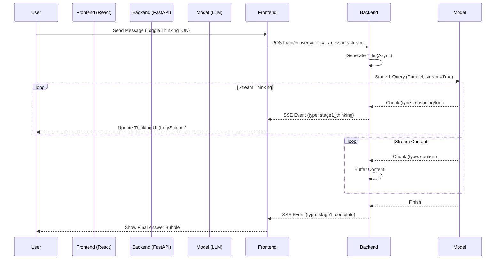

# Thinking Stream Integration Design (RFC)

## 1. 需求汇总 (Requirements Summary)

| ID | 需求项 (Requirement) | 描述 (Description) | 优先级 (Priority) |
| :--- | :--- | :--- | :--- |
| R1 | **思考过程流式展示** | 对于支持 Reasoning 的模型，实时展示其思考/推理过程 (Thinking Process)。 | P0 |
| R2 | **思考开关 (Toggle)** | 用户可手动开启/关闭“展示思考过程”。关闭时维持现有逻辑（仅展示最终结果）。 | P0 |
| R3 | **兼容非 Reasoning 模型** | 对于不支持 Reasoning 的模型，即便开启开关，也应正常工作（无思考过程，直接出结果）。 | P0 |
| R4 | **前端并发展示** | Stage 1 多个议员同时思考时，前端需处理并发的流式更新，不能阻塞。 | P1 |
| R5 | **UI 交互优化** | 思考过程不应占据过多屏幕空间，需平衡“即时性”与“内容干扰”。 | P1 |

## 2. 技术方案 (Technical Architecture)

### 2.1 Backend Refactoring
目前 `backend/openrouter.py` 采用 HTTP 同步请求 (`await client.post(...)`)，无法获取流式数据。需将其改造为流式 Generator。

#### 核心变更点
1.  **Refactor `query_model`**:
    *   新增 `stream: bool = False` 参数。
    *   当 `stream=True` 时，使用 `client.stream(...)`，并 `yield` 数据块。
    *   数据块需区分 `type`: `thinking` (reasoning/tool_calls) vs `content` (answer).

2.  **Update `stage1_collect_responses`**:
    *   现有的 `asyncio.gather` 只能等待全部结束。
    *   **方案**: 使用 `asyncio.as_completed` 或 `Queue` 模型。
    *   将每个模型的 Stream 输出实时推送到 `event_queue` (Main API SSE).

3.  **SSE Protocol Update**:
    *   新增事件: `stage1_thinking`
    *   Payload Example:
    ```json
    {
      "type": "stage1_thinking",
      "councilor_id": "councilor_1",
      "model": "deepseek-r1",
      "delta": "Checking constraints...", # 思考内容片段
      "is_title": false # 是否为标题 (来自 tool call)
    }
    ```

### 2.2 Frontend State Management
前端需独立维护每个议员的 "Thinking State"。

*   **Store Structure**:
    ```javascript
    const [councilorStates, setCouncilorStates] = useState({
      "id_1": { status: "thinking", thinking_log: ["step1...", "step2..."], content: "" },
      "id_2": { status: "thinking", thinking_log: [], content: "" }
    });
    ```

## 3. UI/UX 方案 (UI Options)

### 方案 A: 气泡/折叠面板 (Recommended)
在议员的最终回答气泡上方，显示一个可折叠的“思考中...”区域。

```text
+--------------------------------------------------+
| [Avatar] Councillor A                            |
+--------------------------------------------------+
| > Thinking Process (Click to expand)             |
|   - Analyzing user request...                    |
|   - Checking memory...                           |
|   (Streaming updates...)                         |
+--------------------------------------------------+
| Here is my final answer based on the analysis... |
| ...                                              |
+--------------------------------------------------+
```
*   **优点**: 结构清晰，不干扰最终阅读。
*   **缺点**: 如果多个议员同时展开，屏幕可能较乱。

### 方案 B: 头像状态展示 (User's Idea)
在头像上通过动画或 Tooltip 展示思考状态。

```text
   [Avatar] <--- Tuning/Spinner Overlay
      |
(Hover/Click) -> Popover: "I am thinking about..."
      |
+--------------------------+
| Final Answer Area        |
| (Empty until finished)   |
+--------------------------+
```
*   **优点**: 界面极简。
*   **缺点**: 用户必须交互（点击/悬停）才能看到思考内容，失去了“欣赏思考过程”的直观性。

### 方案 C: 独立思考终端 (Terminal View)
在侧边栏或底部抽屉显示所有议员的实时 Log。

## 4. 讨论点 (Discussion Points)

1.  **UI 选择**: 您更倾向于 **方案 A (折叠面板)** 还是 **方案 B (头像交互)**？
    *   *建议*: 方案 A 更符合 Chat 习惯；方案 B 适合移动端或极简风格。
2.  **开启方式**:
    *   **全局设置**: 在右上角设置里加个 Toggle？
    *   **单次设置**: 发送消息时勾选 "Show Thinking"？
    *   *建议*: 发送框旁加一个小图标/Toggle，默认记录上次选择。
3.  **历史记录**:
    *   思考过程是否需要**保存**到数据库？（刷新页面后还在吗？）
    *   *技术建议*: 思考过程通常很长且 Token 消耗大。建议**不持久化保存**思考过程，只保存最终答案。刷新后只显示答案。

---
**Next Step**: 请确认以上方案，特别是 UI 偏好和由谁来决定是否保存思考历史。

## 附录: 数据流向图 (Data Flow)



## 附录 B: 高并发性能与 UI 细节 (Performance & UI)

### 1. 性能优化策略 (Response to Trae)
Trae 提到的“多线程 UI”在浏览器环境 (JavaScript) 中并不适用（JS 是单线程的）。但他的核心担忧（UI 卡顿）是合理的。
我们将采用 **React Ref + RAF Batching** 策略来替代“多线程”：

*   **问题**: 如果 6 个模型并发，每秒每人发 10 个 token，会导致 每秒 60 次 React Render -> 必卡死。
*   **方案**: 
    1.  **State Buffer (`useRef`)**: SSE 收到消息时，不直接 `setState`，而是写入 `useRef.current` 缓冲池。
    2.  **Render Loop (`requestAnimationFrame`)**: 设置一个 30fps 或 60fps 的定时循环，每帧检查 Buffer 是否有变化。如果有，才触发一次 `setState`。
    3.  **效果**: 无论后端发多快，前端渲染频率被锁死在 60fps 上限，保证流畅。

### 2. 前端 UI 设计: "Glassmorphism Capsule" (毛玻璃胶囊)

**布局**: 
在 `Stage 1` 的 Tab 内容区域上方，悬浮展示。

```ascii
+-------------------------------------------------------+
|  [Avatar] Immanuel Kant   (Tab Header)                |
+-------------------------------------------------------+
|                                                       |
|   +-----------------------------------------------+   |
|   |  🧠 Analyzing ethical constraints...       |   | <--- Floating Pill
|   +-----------------------------------------------+   |
|      (Pulse Animation / Glass Effect)                 |
|                                                       |
|   (Final Answer Area - Initially Empty)               |
|                                                       |
+-------------------------------------------------------+
```

**视觉风格 (CSS)**:
*   **Background**: `bg-muted/80` (半透明) + `backdrop-blur-sm` (毛玻璃)。
*   **Border**: `border border-primary/20` (极细边框)。
*   **Shadow**: `shadow-lg` (浮起感)。
*   **Animation**: 
    - **Enter**: `animate-in fade-in slide-in-from-top-2` (平滑滑入).
    - **Update**: 文本变化时增加淡入淡出。

**交互**:
*   **默认**: 只显示单行最新标题。
*   **点击**: 展开显示最近 5 条思考历史 (Log View)。

