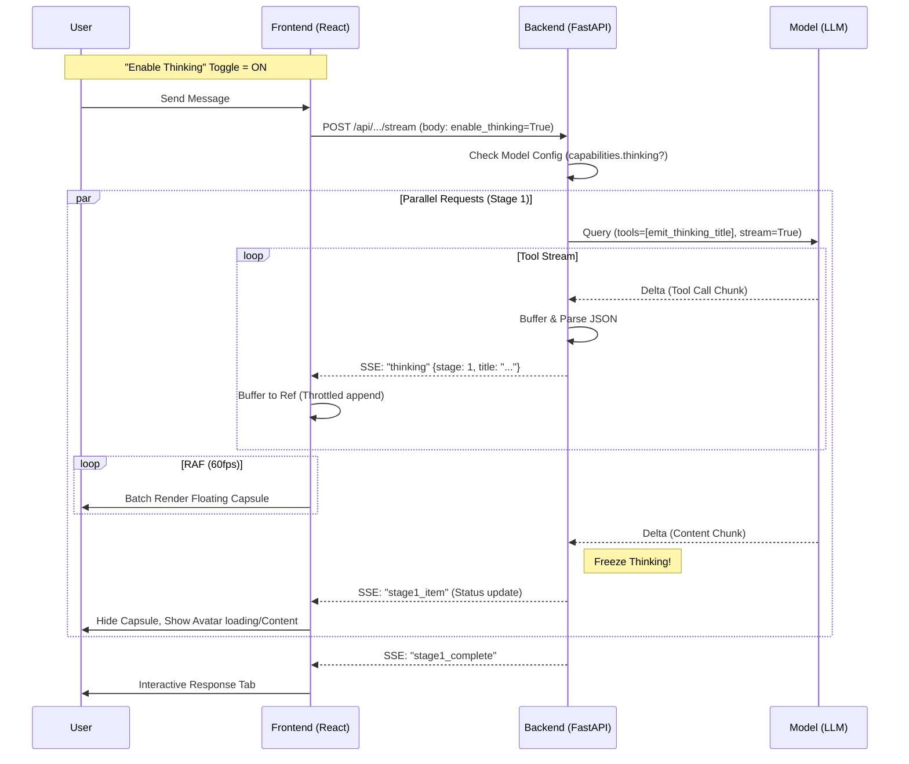

# Thinking Title Stream (流式思考) 完整技术规范书

> **Version**: 2.0 (Final)
> **Status**: Approved for Implementation
> **Author**: Antigravity & Trae
> **Last Updated**: 2025-12-21

## 1. 目录

1.  [用户场景与需求描述](#2-用户场景与需求描述)
2.  [目标与非目标](#3-目标与非目标)
3.  [详细技术方案 (后端)](#4-详细技术方案-后端)
4.  [详细技术方案 (前端)](#5-详细技术方案-前端)
5.  [技术架构与数据流](#6-技术架构与数据流-data-flow)
6.  [UI/UX 设计规范](#7-uiux-设计规范)
7.  [代码变更清单](#8-代码变更清单)

---

## 2. 用户场景与需求描述

### 2.1 核心痛点
当前 LLM Council 在处理复杂问题时，Stage 1 的推理时间可能长达 20-60 秒。在此期间：
*   用户只能看到空白或 Loading 状态，产生“系统卡死”的焦虑。
*   用户无法感知模型是否在有效工作，也无法欣赏不同人设（如康德 vs 特朗普）的独特思维路径。

### 2.2 用户需求
| 需求点 | 详细描述 | 优先级 |
| :--- | :--- | :--- |
| **流式展示** | 实时展示支持 Reasoning 模型的思考/推理步骤（Title），而非最终一次性输出。 | P0 |
| **兼容性** | 对于不支持 Reasoning 的模型，应平滑降级（维持现状，直接出结果），不报错。 | P0 |
| **低干扰 UI** | 思考过程应以“浮动/胶囊”形式呈现，不占据正文空间，不破坏现有选项卡布局。 | P0 |
| **性能流畅** | 即使 6 个模型并发输出思考流，前端界面也不得卡顿（必须处理高频渲染问题）。 | P0 |
| **用户控制** | 提供全局开关（Toggle），状态需在本地持久化。关闭时完全屏蔽思考流。 | P1 |

---

## 3. 目标与非目标

### 3.1 目标 (In Scope)
*   **后端**: 实现 SSE (Server-Sent Events) 双通道推送：`thinking` (思考流) 和 `content` (正文流) 并行。
*   **协议**: 标准化 Tool Call 的分片缓冲 (Buffering) 处理，解决 JSON 截断问题。
*   **前端**: 实现 "Glassmorphism Capsule" (毛玻璃胶囊) UI，支持点击展开历史与自动折叠。
*   **性能**: 采用 `useRef` + `requestAnimationFrame` 批处理策略，锁定 60fps 渲染。

### 3.2 非目标 (Out of Scope)
*   **数据库存储**: 思考过程**不保存**到数据库，刷新页面后即消失（只保留最终答案）。
*   **混合适配 (Hybrid Adapter)**: 暂时不自动抓取 `reasoning_content` 字段，严格依赖 `emit_thinking_title` 工具调用。
*   **多语言翻译**: 思考标题原样输出，不进行实时翻译。

---

## 4. 详细技术方案 (后端)

### 4.1 模型配置策略 (`backend/config.py`)
通过 `GLOBAL_MODEL_POOL` 的 `features` 字段显式声明能力。

```python
GLOBAL_MODEL_POOL = [
    {
        "id": "tngtech/deepseek-r1t2-chimera:free",
        "capabilities": {
            "thinking": True,           # switch
            "thinking_mode": "tool",    # "tool" or "reasoning" (native)
            "reasoning_param": False    # needs include_reasoning=True?
        },
        "category": "reasoning"
    },
    # ... 
]
```

### 4.2 核心流式逻辑 (`backend/openrouter.py`)
将同步请求改造为 **Generator** 模式，实现 **Dual Stream** (双流) 处理。

#### A. 工具定义
注入专用工具 `emit_thinking_title`:
```json
{
  "name": "emit_thinking_title",
  "description": "Report current thinking step. Keep concise.",
  "parameters": {"type": "object", "properties": {"title": {"type": "string"}}}
}
```

#### B. 统一事件结构 (Unified Event)
采用 Gem 建议的统一事件结构，方便 Reducer 处理多阶段扩展。

```json
{
  "type": "thinking",
  "data": {
    "stage": 1, // 1, 2, or 3
    "councilor_id": "councilor_1",
    "title": "Checking constraints...", // Extracted title
    "delta": "" // Optional: raw delta if needed later
  }
}
```

#### C. Stage 2 安全策略 (JSON Safety)
Stage 2 要求严格 JSON 输出。为防止 Content 污染：
1.  **Rule**: 一旦收到 `content` channel 的首个字符，立即进入 **Answering** 状态。
2.  **Action**: 冻结 Thinking UI，且如果之后再收到 thinking tool call，全部丢弃。
3.  **Rationale**: 确保 `content` 缓冲区纯净，只包含 JSON。

#### D. 分片缓冲 (Buffering) 算法
由于 LLM 的 JSON 是流式输出的（如 `{"ti`, `tle": "foo"}`），必须在后端或前端做缓冲。
**决策**: **后端** 负责缓冲拼接。**只有当解析出完整的 `title` 字段时，才生成 `thinking` 事件推给前端**。这能极大减少前端负担和带宽。

---

## 5. 详细技术方案 (前端)

### 5.1 性能优化: Batching Strategy
**严禁** 在 SSE 回调中直接调用 `setState`。
采用 **Ref + RAF Loop** 模式：

```javascript
// 1. Buffer (不触发重绘)
const msgBuffer = useRef({}); 

// 2. SSE Callback
onEvent((event) => {
  if (event.type === 'stage1_thinking') {
    // 仅更新内存数据
    const { councilorId, title } = event.data;
    msgBuffer.current[councilorId] = { status: 'thinking', title };
  }
});

// 3. Render Loop (60fps)
useAnimationFrame(() => {
  if (hasChanges(msgBuffer.current)) {
    forceUpdate(); // 或 setRenderState(...)
  }
});
```

### 5.2 本地持久化与限流
使用 `localStorage` 存储开关状态，并实施严格的数据上限策略：

1.  **开关存储**:
    *   Key: `llm_council_settings_v1`
    *   Value: `{"showThinking": true}`
2.  **数据上限 (Memory Only)**:
    *   Thinking Log 在 React State 中最多保留最新 **50** 条。
    *   不保存到后端数据库。
    *   Filler 消息不进入 History Log。
3.  **渲染节流 (Throttling)**: (Response to Gem)
    *   虽然 RAF 保证了 60fps，但为防止 Log 滚动过快无法阅读：
    *   **Rule**: UI 每 **200ms** 最多追加一次 Log。若后端发送过快，积压在 Buffer 中，下一帧批次处理。

---

## 6. 技术架构与数据流 (Data Flow)



---

## 7. UI/UX 设计规范

### 7.1 组件: Glassmorphism Capsule (毛玻璃胶囊)
悬浮在 `Stage1` 选项卡内容区域的**顶部** (绝对定位)。

```css
.thinking-capsule {
  position: absolute;
  top: 1rem;
  left: 50%;
  transform: translateX(-50%);
  background: rgba(255, 255, 255, 0.7); /* Light Mode */
  backdrop-filter: blur(8px);
  border: 1px solid rgba(0, 0, 0, 0.05);
  border-radius: 9999px;
  padding: 0.5rem 1.25rem;
  box-shadow: 0 4px 6px -1px rgba(0, 0, 0, 0.1);
  z-index: 10;
  
  /* Text */
  font-family: monospace;
  font-size: 0.85rem;
  color: #4b5563;
  display: flex;
  align-items: center;
  gap: 0.5rem;
}

/* Dark Mode Adaptation */
.dark .thinking-capsule {
  background: rgba(0, 0, 0, 0.6);
  border-color: rgba(255, 255, 255, 0.1);
  color: #e5e7eb;
}
```

### 7.2 交互状态
1.  **Thinking (Active)**:
    *   显示: `[Spinner] [Title Text]`
    *   动画: 整体轻微 `Pulse` (呼吸)。
2.  **Delay/Filler**:
    *   若 3s 无 Title 且未结束，显示 Filler 文本 ("Connecting neural pathways...")。
3.  **Finished (History)**:
    *   胶囊消失。
    *   (可选项) 点击头像可查看 "Thinking Log" 抽屉。

---

## 8. 代码变更清单

### 8.1 Backend
| 文件路径 | 关键修改 | 复杂度 |
| :--- | :--- | :--- |
| `backend/config.py` | `GLOBAL_MODEL_POOL` 添加 `features` 字段。 | Low |
| `backend/openrouter.py` | 新增 `AsyncGenerator` 类型的 `query_model_stream`。处理 HTTP 流并 parser SSE。 | High |
| `backend/council.py` | `_request_stage1_bounded`: 集成 Tool 定义。`stage1_collect_responses`: 改造为 Queue 模式接收 Generator 数据。 | High |
| `backend/main.py` | `event_generator`: 增加对 `stage1_thinking` 事件的监听和广播。 | Medium |

### 8.2 Frontend
| 文件路径 | 关键修改 | 复杂度 |
| :--- | :--- | :--- |
| `src/api.js` | `fetchEventSource` 处理逻辑更新，解析新事件类型。 | Low |
| `src/App.jsx` | 增加 Toggle 开关组件；读取/写入 `localStorage`。 | Low |
| `src/components/Stage1.jsx` | 引入 `useRef` 缓冲池；实现 `ThinkingCapsule` 组件；CSS 样式编写。 | High |
