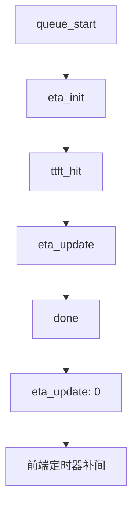

# ETA 进度预估（Stage1/2/3）技术方案

## 目录
1. 用户场景与需求描述
2. 现状复盘（与需求相关部分）
3. 设计目标与约束
4. 详细技术方案
   - 4.1 RuntimeStats 与并发追踪结构（按 Stage 分桶）
   - 4.2 采样与过滤规则
   - 4.3 ETA 计算公式
   - 4.4 队列等待估算（per-model）
   - 4.5 进度区间锁定（事件驱动 + 平滑）
   - 4.6 SSE 事件设计（事件驱动）
   - 4.7 前端展示规范
   - 4.8 冷启动默认值
   - 4.9 ETA 准确度监控（可选）
5. 流程图
6. ASCII 原型
7. 需要改动的代码文件与关键修改点
8. 边界条件与降级策略
9. 验收标准
10. 风险与缓解

---

## 1. 用户场景与需求描述

### 1.1 典型场景
| 场景 | 用户行为 | 期望体验 | 关键痛点 |
|---|---|---|---|
| Stage1 生成中 | 提交问题后等待 | 看到每位议员的进度柱渐进 | 现有进度是“假定定时器”，不可信 |
| Stage2 评审中 | 多评审并行 | 看到阶段总体 ETA | 不知道还要等多久 |
| Stage3 综合中 | 主席总结 | 看到阶段 ETA | 结束时间不可预期 |

### 1.2 明确需求
- **Stage1**：继续使用现有 **per-councilor 进度柱**（TacticalHUD 的柱体），只替换为基于 ETA 的计算逻辑。
- **Stage2**：卡片 **header** 仅保留 `done/total + ETA 文本`（不显示进度条）。
- **Stage3**：本轮不改动（后续若实现，沿用 header ETA 文本方案）。
- **TTFT 来源**：运行时更新 + probe 兜底，不新增 OpenRouter 请求。
- **不修改现有业务流程**：仅引入 ETA 统计与展示。
- **映射说明**：Stage1 进度柱是 per-councilor UI，但底层统计来源是 per-model（通过 model_assignments 映射）。

---

## 2. 现状复盘（与需求相关部分）
| 组件 | 现状 | 问题 |
|---|---|---|
| Health TTFT | 仅 probe 更新 | 运行时 TTFT 缺失，ETA 失真 |
| Stage1 进度 | 前端定时器模拟 | 进度与真实耗时无关 |
| Stage2/3 ETA | Stage2 有 ETA 文本；Stage3 无 | Stage3 等待感知弱 |

---

## 3. 设计目标与约束

### 3.1 目标
- 真实度：用运行时统计替代假定进度。
- 稳定性：进度不倒退、不闪烁。
- 低侵入：不新增外部 API 请求。

### 3.2 约束
- 不新增 OpenRouter 调用。
- 不持久化 ETA（仅运行期数据）。
- 与固定模型分配（schema v3）兼容。

---

## 4. 详细技术方案

### 4.1 RuntimeStats 与并发追踪结构（按 Stage 分桶）
**目标**：将性能统计与健康状态解耦，避免 HealthRecord 责任混杂。

RuntimeStats（按 model + stage 分桶）：
```
RuntimeStats[(model, stage)]
├── ema_ttft_ms: float
├── ema_generation_ms: float
├── ema_total_ms: float
├── sample_count: int
└── last_updated_at: datetime
```
Stage 维度说明：`stage` 取 `stage1/stage2/stage3`，同一模型在不同阶段**分桶统计**，避免阶段间分布混淆。

ConcurrencyTracker（按 model 统计）：
```
ConcurrencyTracker[model]
├── inflight: int
└── queued: int
```

数据来源与更新时机：
| 指标 | 来源 | 更新时机 | 说明 |
|---|---|---|---|
| `ttft_ms` | `stream_model` 返回 | 每次运行时请求完成 | 首 token 时间 |
| `generation_ms` | `total_ms - ttft_ms` | 每次运行时请求完成 | 生成耗时 |
| `total_ms` | 运行时计时 | 每次运行时请求完成 | 总耗时 |
| `ema_*` | RuntimeStats | 每次运行时请求完成 | 稳定估计 |

HealthRecord 保持健康状态与 probe 兜底职责。

### 4.2 采样与过滤规则
**日志已出现异常样本**（例如 `total_ms=1` 且 `ttft_ms=6000`），必须过滤。

过滤规则（任一命中则丢弃样本）：
- `ttft_ms` 为 null
- `total_ms <= 0`
- `ttft_ms > total_ms`

仅在样本通过校验后更新 RuntimeStats。

### 4.3 ETA 计算公式
```
ETA_remaining_ms
  = queue_wait_ms[model]
  + ttft_ms_est[(model, stage)]
  + generation_ms_est[(model, stage)]
```

**估计优先级**：
1. 运行时 EMA（优先）
2. Health 的 p50 / ema（兜底）
3. last_ttft（最终兜底）

**Stage2/3 阶段 ETA**：按 per-judge 计算，取 max 作为阶段剩余时间。

### 4.4 队列等待估算（per-model）
| 方法 | 公式 | 说明 |
|---|---|---|
| 推荐估计 | `(queued[model] / concurrency_limit) * avg_total_ms[(model, stage)]` | per-model 稳定估算 |
| 兜底估计 | `inflight[model] * avg_total_ms[(model, stage)] / concurrency_limit` | queued 不可用时 |

> 说明：固定模型分配下，队列按 **模型** 而非 councilor 统计。

### 4.5 进度区间锁定（事件驱动 + 平滑）
**区间锁定规则**：
```
QUEUEING     0% - 10%
TTFT_WAIT    10% - 30%
GENERATING   30% - 90%
DONE         100%
```

**区间内计算**（示例）：
```
if done:
    progress = 100%
elif ttft_received:
    progress = 30% + (elapsed_gen / est_gen) * 60%
elif ttft_pending:
    progress = 10% + (elapsed_ttft / est_ttft) * 20%
else:
    progress = (elapsed_queue / est_queue) * 10%
```

**单调与平滑**（可选）：
```
progress = max(last_progress, progress)
progress = last + (progress - last) * 0.2
```

### 4.6 SSE 事件设计（事件驱动）
后端只在关键事件推送，前端做补间平滑：
```
queue_start -> eta_init
ttft_hit    -> eta_update
done        -> eta_update (0)
```

事件负载（仅推剩余时间，不推绝对时间）：
| 字段 | 类型 | 说明 |
|---|---|---|
| `type` | string | `"eta_update"` |
| `stage` | string | `stage1/stage2/stage3` |
| `councilor_id` | string | stage1/2 通用，stage2 填 judge_id |
| `eta_ms_remaining` | number | 剩余时间（ms） |
| `model` | string | 可选 |
| `reason` | string | `queue_start/ttft_hit/done` |

### 4.7 前端展示规范
| 阶段 | 展示位置 | 展示形式 | 说明 |
|---|---|---|---|
| Stage1 | TacticalHUD 进度柱 | **仅进度柱** | 不显示 ETA 文本 |
| Stage2 | Stage2 卡片 header | done/total + ETA 文本（无进度条） | 阶段级 |
| Stage3 | Stage3 卡片 header | ETA 文本（后续实现） | 阶段级 |

**ETA 文本格式**：`ETA ~ 8s`（整数秒，向上取整）。

### 4.8 冷启动默认值
建议在配置中提供默认 ETA，用于样本不足时：
```
DEFAULT_ETA_CONFIG = {
  "default_ttft_ms": 2000,
  "default_generation_ms": 5000,
  "default_queue_wait_ms": 1000,
  "warmup_sample_count": 3
}
```

Stage1 默认值可直接用于进度估算，完成后用真实数据校正。
Stage2 缺失时使用默认 ETA 配置驱动进度与 ETA 文本（不显示“估算中”）。

### 4.9 ETA 准确度监控（可选）
每次请求完成时记录预测值与实际耗时，便于后续调优：
```
predicted_eta_ms, actual_ms, error_rate
```

---

## 5. 流程图



---

## 6. ASCII 原型

### Stage1（HUD 进度柱）
```
Tactical HUD (Stage 1)
-------------------------------------------------
Kant     [######------] 60%
Trump    [########----] 80%
Kojima   [###---------] 30%
-------------------------------------------------
```

### Stage2（Header ETA 文本）
```
[Stage 2: Peer Rankings]                  ETA ~ 14s
----------------------------------------------------
Done: 2/3
```

### Stage3（Header ETA 文本，后续对齐）
```
[Stage 3: Final Council Answer]           ETA ~ 8s
```

### ETA 事件时序（后端事件 + 前端补间）
```
后端事件:  eta=5s ──► eta=3s ──► eta=0s
前端补间:   5→4→3→3→2→1→0→done
```

---

## 7. 需要改动的代码文件与关键修改点

| 文件 | 关键修改 | 目的 |
|---|---|---|
| `backend/runtime_stats.py` (new) | RuntimeStats 按 (model, stage) 分桶 | 性能统计存储 |
| `backend/concurrency_tracker.py` (new) | inflight/queued 统计 | 队列等待估算 |
| `backend/council.py` | 运行时统计写入 + ETA 计算 | 后端 ETA 核心 |
| `backend/main.py` | SSE 增加 `eta_update` 事件 | 前端接入 |
| `frontend/src/hooks/useParliamentEngine.js` | 处理 `eta_update` 并维护进度状态 | 驱动 UI |
| `frontend/src/components/TacticalHUD.jsx` | 进度柱改为 ETA 驱动 | Stage1 替换旧逻辑 |
| `frontend/src/components/Stage2.jsx` | Header ETA 文本（无进度条） | Stage2 展示 |
| `frontend/src/components/Stage3.jsx` | Header ETA 文本（后续） | Stage3 展示 |
| `backend/config.py` | 默认 ETA 配置项 | 冷启动兜底 |

---

## 8. 边界条件与降级策略
| 情况 | 行为 | 说明 |
|---|---|---|
| Stage1 无历史样本 | 使用默认 ETA 配置 | 避免进度空白 |
| Stage2 无历史样本 | 使用默认 ETA 配置 | 保持进度与 ETA 可用 |
| Stage2 被跳过 | HUD 进度 100% + `SKIPPED` | 明确跳过原因 |
| ETA 波动 | 单调 + 平滑 | 避免进度倒退 |
| 采样异常 | 丢弃样本 | 防止 EMA 污染 |

---

## 9. 验收标准
1. Stage1 HUD 进度柱由 ETA 驱动，不再使用定时器。
2. Stage2 卡片 header 显示 `done/total + ETA 文本`（无进度条）；Stage3 后续对齐。
3. ETA 进度 **不倒退、不闪烁**。
4. 不新增 OpenRouter 请求。
5. RuntimeStats 按 (model, stage) 分桶生效。
6. 异常样本不会进入 EMA 统计。

---

## 10. 风险与缓解
| 风险 | 影响 | 缓解 |
|---|---|---|
| 估算不准 | 进度偏早/偏晚 | EMA 平滑 + 兜底统计 |
| 并发波动 | 进度抖动 | 单调锁定 |
| 缺少模型数据 | 无 ETA | 默认值兜底 |
| 异常样本 | EMA 污染 | 过滤规则 |
