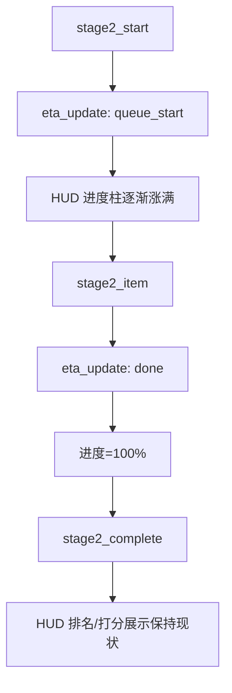

# Stage2 HUD 进度柱复用（ETA）方案

## 目录
1. 用户场景与需求描述
2. 现状复盘（与需求相关部分）
3. 设计目标与约束
4. 详细技术方案
   - 4.1 事件与统计分桶
   - 4.2 Stage2 进度柱计算逻辑（复用 Stage1 算法）
   - 4.3 Stage2 header 展示规范
   - 4.4 Stage2 跳过（候选不足）处理
   - 4.5 状态与事件映射
5. 流程图
6. ASCII 原型
7. 需要改动的代码文件与关键修改点
8. 边界条件与降级策略
9. 验收标准
10. 风险与缓解

---

## 1. 用户场景与需求描述

### 1.1 典型场景
| 场景 | 用户行为 | 期望体验 | 当前痛点 |
|---|---|---|---|
| Stage2 评审进行中 | 等待评审结果 | 底部 HUD 每位 judge 进度柱逐渐涨满 | HUD 在 Stage2 不显示进度柱 |
| Stage2 评审完成 | 查看排名/打分 | HUD 展示内容与当前一致 | 无 |
| Stage2 被跳过 | 有效候选不足 | HUD 直接满格 + 标识跳过 | 目前无明确表现 |

### 1.2 明确需求（已确认）
- Stage2 使用 **TacticalHUD 的 per-judge 进度柱**，进度逻辑与 Stage1 相同（逐渐涨满）。
- Stage2 完成后 HUD 展示内容 **保持现状不变**（排名/打分 badge 等）。
- Stage2 ETA 逻辑 **复用算法**，但统计来源 **必须是 stage2 分桶**。
- Stage2 header 移除进度条，仅保留 `done/total + ETA 文本`。
- Stage2 被跳过时：进度柱直接 100%，并显示 `SKIPPED`。
- 不新增 OpenRouter 请求。
- Stage2 进度柱语义：`councilor_id` 继续填 judge_id（不新增字段）。
- Stage2 进度柱视觉：填充更淡（低透明度）以区分评审阶段。

---

## 2. 现状复盘（与需求相关部分）
| 组件 | 现状 | 问题 |
|---|---|---|
| TacticalHUD 进度柱 | Stage1/Stage2 显示（Stage2 更淡） | 无 |
| Stage2 header | done/total + ETA 文本（无进度条） | 无 |
| ETA 事件 | Stage1/Stage2 | 无 |
| RuntimeStats | 按 stage 分桶 | Stage2 分桶生效 |

---

## 3. 设计目标与约束

### 3.1 目标
- Stage2 HUD 进度柱成为主进度反馈。
- 进度稳定、单调、与 ETA 逻辑一致。
- 完成后 HUD 展示保持原样。

### 3.2 约束
- 不新增 OpenRouter 调用。
- 统计必须按 stage2 分桶。
- 不影响 Stage1/Stage3 已有 UI 行为。

---

## 4. 详细技术方案

### 4.1 事件与统计分桶
- 统计来源：`RuntimeStats[(model, stage2)]`。
- ETA 算法复用 Stage1，数据桶改为 stage2。
- Stage2 关键事件：
  - `stage2_start` -> 推送 `eta_update` (reason=queue_start, councilor_id=judge_id)
  - `stage2_item` -> 推送 `eta_update` (reason=done, councilor_id=judge_id)
- 字段约定：继续使用 `councilor_id` 承载 judge_id，避免引入新字段。
- Stage2 skipped：后端对每个 judge 推送一次 `eta_update` (reason=done)，前端标记 SKIPPED。

### 4.2 Stage2 进度柱计算逻辑（复用 Stage1 算法）
- 复用 Stage1 的前端进度逻辑：
  - `queue_start` 启动平滑定时器，进度逐渐涨到 90%。
  - `done` 置为 100%。
- 进度必须单调递增，不允许回退。
- Stage2 视觉区分：进度填充保持同样样式，但降低不透明度（更淡）。
- Stage2 开始时清空进度与 ETA，避免 Stage1 残留。

### 4.3 Stage2 header 展示规范
- 移除 Stage2 header 的进度条。
- 保留 `done/total` 与 `ETA 文本`。
- ETA 文本样式保持 Stage2 header 当前风格。

### 4.4 Stage2 跳过（候选不足）处理
- 触发条件：Stage2 被标记 skipped。
- HUD 行为：
  - 全部进度柱直接 100%。
  - 每根柱子显示 `SKIPPED` 标记（右上角 badge）。

### 4.5 状态与事件映射
| 事件 | 前端行为 | 目标 UI |
|---|---|---|
| stage2_start + eta_update(queue_start) | 启动 per-judge 进度柱填充 | HUD 渐进 | 
| stage2_item + eta_update(done) | 单个 judge 进度=100% | HUD 柱子满格 | 
| stage2_complete | HUD 排名/分数展示保持现状 | 右上角 badge | 
| stage2 skipped | 全部进度=100% + SKIPPED | 明确跳过 | 

---

## 5. 流程图



---

## 6. ASCII 原型

### Stage2 进行中
```
HUD / Stage2 (Judge Progress, lighter fill)
--------------------------------
Kant    [#####-----] 55%
Trump   [#######---] 70%
Kojima  [###-------] 30%
--------------------------------
```

### Stage2 完成后（保持现状）
```
HUD / Stage2 (Done)
--------------------------------
Kant    [##########] 100%   #1.0
Trump   [##########] 100%   #2.3
Kojima  [##########] 100%   #2.7
--------------------------------
```

### Stage2 被跳过
```
HUD / Stage2 (Skipped)
--------------------------------
Kant    [##########] 100%   SKIPPED
Trump   [##########] 100%   SKIPPED
Kojima  [##########] 100%   SKIPPED
--------------------------------
```

---

## 7. 需要改动的代码文件与关键修改点

| 文件 | 关键修改 | 目的 |
|---|---|---|
| `backend/main.py` | Stage2 发出 `eta_update` 事件（queue_start/done） | 驱动 Stage2 HUD 进度 |
| `backend/council.py` | Stage2 统计写入 `RuntimeStats[(model, stage2)]` | ETA 统计分桶 | 
| `frontend/src/hooks/useParliamentEngine.js` | `handleEtaUpdate` 支持 stage2 | 驱动 HUD 进度柱 |
| `frontend/src/components/TacticalHUD.jsx` | 允许 Stage2 渲染进度柱 + 降低填充透明度 | HUD 复用 + 视觉区分 |
| `frontend/src/components/Stage2.jsx` | 移除 header 进度条，仅保留 done/total + ETA | UI 简化 |

---

## 8. 边界条件与降级策略
| 情况 | 行为 |
|---|---|
| Stage2 ETA 无样本 | 使用默认值，仍可启动 HUD 进度 | 
| Stage2 被跳过 | 全部进度=100% + SKIPPED | 
| ETA 估算波动 | 进度单调递增 + 平滑 | 

---

## 9. 验收标准
1. Stage2 期间 HUD per-judge 进度柱按 ETA 逐渐涨满。
2. Stage2 完成后 HUD 显示与当前一致（排名/分数不变）。
3. Stage2 header 不再显示进度条，仅保留 done/total + ETA 文本。
4. Stage2 被跳过时 HUD 进度柱 100% 并标识 SKIPPED。
5. ETA 统计使用 stage2 分桶，不复用 stage1 数据。

---

## 10. 风险与缓解
| 风险 | 影响 | 缓解 |
|---|---|---|
| Stage2 ETA 估算偏差 | HUD 进度不准 | 采用 EMA 分桶 + 兜底默认值 |
| 事件缺失 | 进度不更新 | stage2_start 强制发送 queue_start | 
| UI 冲突 | 双进度条混淆 | 移除 Stage2 header 进度条 |

---

*Last updated: 2026-01-03*
