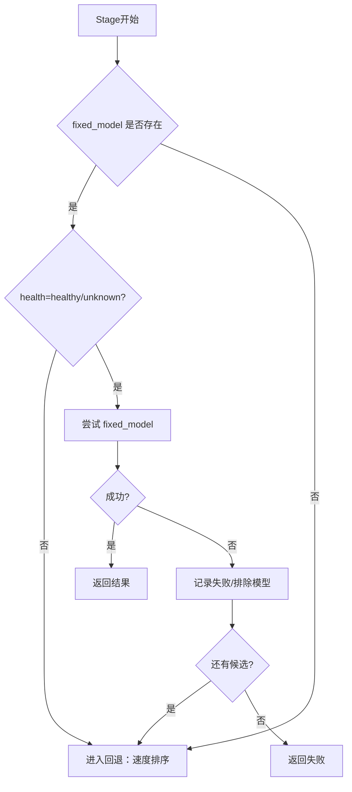
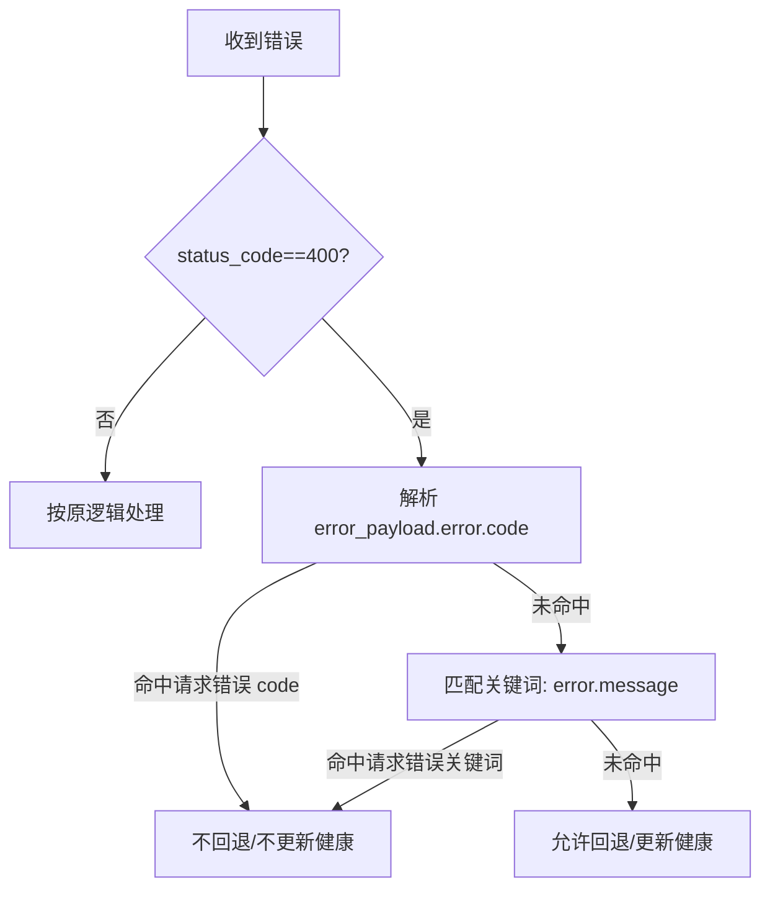

# 软回退与阶段重试机制规格说明（LLM Council Sentinel）

版本: v1.0
日期: 2026-01-03
范围: 后端三阶段执行（Stage1/Stage2/Stage3）模型调用与回退逻辑

---

## 目录
1. 背景与用户场景
2. 需求描述与决策记录
3. 术语与定义
4. 现状分析
5. 目标行为与总体策略
6. 详细技术方案
7. 流程图与交互示意
8. 需要改动的代码文件与关键修改点
9. 边界条件与兼容性
10. 测试与验证建议
11. 验收标准与检查清单
12. 风险与回滚策略

---

## 1. 背景与用户场景

### 1.1 用户场景
用户在使用 LLM Council Sentinel 时，发现当某个模型调用返回 400 或其它错误时：
- 当前议员的 action 直接失败
- 后续阶段（Stage2/Stage3）无法正常进行
- 在固定模型分配（schema_version=3）场景下，不存在自动切换模型的机制

### 1.2 业务痛点
- 固定模型失败会导致整体流程“半瘫痪”
- 已配置多模型候选池，但固定模式下无法利用
- 动态模式可回退，但新对话默认采用固定分配

---

## 2. 需求描述与决策记录

### 2.1 需求描述（用户确认）
- 增加重试/回退机制：
  - 任意 stage 调用失败时，改用速度排序中最快的其它候选模型
- 固定分配允许软回退：
  - 首选固定模型，但失败后允许切换
- 回退不更新 `model_assignments`：
  - 回退仅对本次请求生效
- 400 错误进行分类处理：
  - “请求本身错误”不回退
  - “模型不可用/权限/不存在”等回退
- 回退次数：用完候选列表
- Stage 级总时间上限：每个 stage 180s
- 如果 health 为 cooldown/unhealthy，固定模型直接跳过
- 回退阶段强制使用速度排序（忽略 auto_route_by_speed）

### 2.2 关键决策记录（最终确认）
| 项 | 决策 |
|---|---|
| 固定分配是否允许软回退 | 允许 |
| 回退发生后是否更新 model_assignments | 不更新 |
| 400 错误处理策略 | 分类处理，非请求错误可回退 |
| 回退次数上限 | 全量候选 |
| Stage 级 deadline | 180s 每个 stage |
| 固定模型健康状态 | 非 healthy/unknown 直接回退 |
| 回退阶段排序 | 强制速度排序 |

---

## 3. 术语与定义

| 术语 | 定义 |
|---|---|
| fixed_model | 对话固定分配的模型（schema_version=3） |
| model_assignments | 对话中保存的固定模型分配表 |
| 软回退 | 固定模型失败后允许切换其它候选 |
| 速度排序 | 基于 TTFT 的候选模型排序策略 |
| 请求错误 | 由参数/格式/上下文长度导致的 400 |
| 模型错误 | 模型不存在/权限/不可用导致的 400 |

---

## 4. 现状分析

### 4.1 当前行为（代码现状）
| Stage | 动态模式 | 固定模式 |
|---|---|---|
| Stage1 | 失败后尝试其它候选 | 失败即终止 |
| Stage2 | 失败后尝试其它候选；JSON 修复重试 | 失败即终止 |
| Stage3 | 同模型重试 1 次，再切换候选 | 失败即终止 |

### 4.2 关键问题（已解决）
- 固定模式下无回退 → 已升级为“固定优先 + 软回退”
- 400 错误无可靠分类 → 已补充 `status_code/error_payload` 并实现分类
- Stage3 无 stage-level deadline → 已新增 STAGE3_DEADLINE（软截止）

---

## 5. 目标行为与总体策略

### 5.1 目标行为
| Stage | 首选模型 | 回退策略 | 终止条件 |
|---|---|---|---|
| Stage1 | fixed_model（若健康） | 速度排序候选 | 180s 或候选耗尽 |
| Stage2 | fixed_model（若健康） | 速度排序候选 | 180s 或候选耗尽 |
| Stage3 | fixed_model（若健康） | 速度排序候选 | 180s 或候选耗尽 |

### 5.2 总体策略
- 固定模型仍是首选
- 失败后回退至最快候选（排除已失败模型）
- 回退阶段强制速度排序
- 固定模型若为 cooldown/unhealthy，直接跳过

---

## 6. 详细技术方案

### 6.1 模型选择与回退策略
1. 若存在 fixed_model：
   - 查询 health 状态
   - 若健康为 healthy/unknown，则尝试 fixed_model
   - 否则直接进入回退流程
2. 回退流程：
   - 基于候选列表过滤健康模型
   - 强制速度排序（忽略 auto_route_by_speed）
   - 排除已失败模型
   - 用完候选即返回失败

### 6.2 Stage 级 deadline
- Stage1/Stage2 使用 STAGE1_DEADLINE/STAGE2_DEADLINE = 180s
- Stage3 使用 STAGE3_DEADLINE = 180s（软截止：仅在候选切换点检查，不强制中断单次请求）
- Stage1/Stage2 启用 deadline 时仍应在每个 Councilor 完成时实时输出 `stage*_item`

### 6.3 400 错误分类
分类优先级（必须按顺序执行）：  
1) 先捕获 status_code==400  
2) 优先解析 `error_payload.error.code`  
3) 若 code 不可用或不命中，再进行关键词匹配  

**Step 1: code 优先判断（不回退）**  
以下 code 认为是“请求错误”，不回退、不更新健康：  
- context_length_exceeded  
- invalid_request  
- invalid_api_key  

**Step 2: 关键词匹配范围（只匹配指定字段）**  
仅匹配以下字段：  
- `error_payload.error.message`  
- `error.message` 或响应中的 `content`（当无 payload 时）  
不扫描全量 payload，避免误判。  

**请求错误关键词（不回退）：**
- context
- token limit
- invalid request
- invalid json
- tool
- function
- bad request

**模型错误关键词（可回退）：**
- not found
- unavailable
- permission
- unauthorized
- disabled
- provider

### 6.4 错误分类策略输出
| 错误类型 | 回退 | 更新健康状态 |
|---|---|---|
| 请求错误 | 否 | 否 |
| 模型错误 | 是 | 是 |
| 其它 400 | 是（保守） | 是 |

### 6.5 SSE 事件展示策略
- meta 中显示 `assigned_model`
- stage item 中显示 `used_model`
- stage item 额外字段建议：
  - `fallback_used`
  - `attempted_models`

### 6.6 日志与可观测性
- request.log 记录每次调用的实际模型与回退路径
- 对 400 分类结果添加结构化字段（error_class）
- 回退链路字段建议：`fallback_count` / `fallback_reason` / `fallback_chain`
- Stage3 触发“连续两次非请求错误失败”时记录 warning 日志

### 6.7 Stage3 特殊处理（输入依赖）
Stage3 输入依赖 Stage1/Stage2 结果，换模型未必能解决上游输入歧义。  
为兼顾可用性与可观测性，增加以下策略：  
- 若连续 2 个模型均以“非请求错误”失败，记录 warning 日志（不阻止回退）  
- 仍继续回退直至候选耗尽或达到 180s deadline  

---

## 7. 流程图与交互示意

### 7.1 软回退流程图


### 7.2 400 分类流程


### 7.3 ASCII 交互示意
```
[Meta]
Assigned:
- Kant -> nemotron-3-nano

[Stage1 Item]
Used Model: nemotron-9b-v2
Fallback: Yes
Attempts: [nemotron-3-nano, nemotron-9b-v2]
```

### 7.4 Stage1 并发回退结构（ASCII）
```
Stage1.start
   │
   ├──▶ [Councilor A] ──┐
   │                   ├─▶ 回退循环独立
   ├──▶ [Councilor B] ──┤
   │                   ├─▶ 回退循环独立
   └──▶ [Councilor C] ──┘
           │
           ▼
      Stage1.done (等待所有完成或 deadline；已完成结果实时返回)
```

---

## 8. 需要改动的代码文件与关键修改点

| 文件 | 关键函数 | 修改点 |
|---|---|---|
| `backend/council.py` | `_request_stage1_bounded` | 固定模型健康检查；软回退；强制速度排序；180s stage deadline 配合 |
| `backend/council.py` | `_collect_single_ranking_bounded` | 固定模型健康检查；软回退；强制速度排序；400 分类处理 |
| `backend/council.py` | `stage3_synthesize_final` | 新增 stage3 总时限；软回退；强制速度排序 |
| `backend/openrouter.py` | `stream_model` | 捕获 HTTPStatusError，返回 status_code/headers/error_payload |
| `backend/config.py` | 常量定义 | 设置 `STAGE1_DEADLINE=180`, `STAGE2_DEADLINE=180`，新增 `STAGE3_DEADLINE=180` |
| `backend/main.py` | SSE 输出 | 确保 stage item 输出实际 used_model/attempted_models |
| `backend/health.py` | `update_status` | 根据错误分类结果决定是否更新健康 |

---

## 9. 边界条件与兼容性

- 旧对话（schema_version < 3）仍按动态模式运行
- 固定模式回退不更新 assignments，避免持久化污染
- 若所有候选均失败，仍返回失败结构
- Stage deadline 触发时：未完成任务统一返回失败占位

---

## 10. 测试与验证建议

| 测试用例 | 目标 |
|---|---|
| fixed_model unhealthy → 直接回退 | 验证健康跳过 |
| 400 请求错误 → 不回退 | 验证分类逻辑 |
| 400 模型错误 → 回退 | 验证回退逻辑 |
| Stage1/2/3 deadline 180s | 验证 stage 级超时 |
| SSE 展示 used_model | 验证 UI/数据一致性 |

---

## 11. 验收标准与检查清单

### 11.1 验收标准（可量化）
| 编号 | 标准 | 验收方式 |
|---|---|---|
| AC-01 | 固定分配对话在模型失败时可回退至其他候选 | 构造固定对话 + 主模型失败，观察 stage item 中 used_model 变化 |
| AC-02 | 400 请求错误不触发回退 | 触发 context length/invalid request，观察 attempted_models 不变 |
| AC-03 | 400 模型错误可回退 | 触发 model not found/permission，观察 fallback_used=true |
| AC-04 | Stage1/2/3 均受 180s deadline 限制 | 单 stage 总耗时 >=180s 时返回 deadline 失败 |
| AC-05 | SSE 事件能区分 assigned_model 与 used_model | 检查 meta 与 stage item 字段展示 |

### 11.2 验收检查清单（Check List）
- [ ] 固定模型健康为 cooldown/unhealthy 时不被调用
- [ ] 固定模型健康为 healthy/unknown 时优先调用
- [ ] 失败后严格排除已失败模型
- [ ] 回退阶段强制速度排序（忽略 auto_route_by_speed）
- [ ] attempted_models 按实际调用顺序记录
- [ ] 400 分类命中“请求错误关键词”不更新健康
- [ ] 400 分类未命中或模型错误会更新健康
- [ ] Stage3 也有与 Stage1/2 一致的总时限
- [ ] Stage3 连续两次非请求错误失败会记录 warning 日志
- [ ] 旧对话（schema_version <3）行为不回归

## 12. 风险与回滚策略

### 12.1 风险
- 400 分类误判可能导致错误回退或错误终止
- 回退链条过长导致耗时接近 deadline
- 速度排序依赖 TTFT 健康数据，数据陈旧时排序失真

### 12.2 回滚策略
- 可通过 config 恢复固定硬模式
- 回退逻辑可用 feature flag 控制（建议预留）

---

# 结论
本方案实现“固定模型优先 + 软回退 + stage 级 deadline”的一致性机制，并通过 400 错误分类避免无意义回退，保证三阶段在异常情况下仍具备可用性和稳定性。

