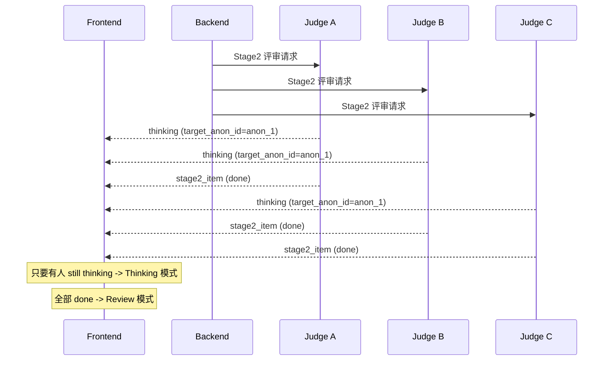

# Stage2 Thinking Stream & Review Replace 规范说明 (v0.4)

- Version: v0.4
- Status: 已验收（Stage2 功能验收 OK，仅更新文档）
- Scope: Stage2 DetailPanel Thinking 流展示 + Review 覆盖；Stage1/Stage3 Thinking->内容 cross-fade 过渡；Stage2 `target_anon_id` 过滤；自评允许
- Source of truth: `backend/council.py`, `backend/main.py`, `frontend/src/hooks/useParliamentEngine.js`, `frontend/src/components/DetailPanel.jsx`

---

## 目录

1. 背景与目标
2. 术语与 ID 定义
3. 需求与决策汇总
4. 现状快照（与代码一致）
5. 详细技术规范
6. 流程图（Mermaid + ASCII）
7. ASCII UI Mock
8. 动画与视觉规范
9. Edge Cases
10. 涉及文件与关键逻辑
11. 验收清单
12. 未决事项

---

## 1. 背景与目标

Stage2 是匿名互评阶段。目标是在 **DetailPanel 的同一区域** 实时展示评审员的思考进度（title + detail 两行），并在评审结果到达后用动画 **直接替换** thinking 区域，保持界面简洁。

关键目标：

- **不新增新区域**：Thinking 与 Review 共用 DetailPanel 的内容区
- **只显示最新一步**：保留 steps 数据，但 UI 展示最新 title + detail
- **只显示 activeTab 相关**：通过 `target_anon_id` 精确过滤
- **自评允许**：评审员可以评价自己的匿名答案，UI 不做特殊处理
- **不做历史回放**：Stage2 Thinking 只在实时阶段出现

---

## 2. 术语与 ID 定义

| 名称 | 说明 | 示例 |
|---|---|---|
| `judgeId` | 评审员 ID（SSE `thinking` 事件里的 `councilor_id`） | `donald_trump` |
| `target_anon_id` | Stage2 匿名候选 ID | `anon_2` |
| `targetId` | 真实 councilor_id，由 `anon_map` 映射得到 | `immanuel_kant` |
| `activeTab` | 当前用户选中的被评议对象 ID；共识页为 `final` | `immanuel_kant` |

**注意**：`judgeId` 与 `targetId` 可能相同（自评允许）。

---

## 3. 需求与决策汇总

| 需求项 | 决策与约束 | 备注 |
|---|---|---|
| 事件类型 | 复用 `thinking` 事件 | 不新增 `thinking_delta` |
| 显示格式 | 标题为主行、detail 为第二行 | 与 Stage1 保持一致 |
| 语言 | Stage2 thinking 必须中文 | prompt 强制 |
| 过滤维度 | 使用 `target_anon_id` -> `activeTab` | 思考只展示与 activeTab 相关 |
| Thinking 频率 | 2-3 步 | prompt 要求多次调用 |
| 历史回放 | 不支持 | 仅实时显示 |
| Thinking->Review | Review 直接覆盖 thinking | 有动画过渡 |
| activeTab 切换 | 不重置 thinking 数据，仅切换显示 | 保留已收到步骤 |
| Stage1/3 过渡 | 同样 cross-fade + 轻微上移 | 180-240ms |
| 自评 | 允许 | 不隐藏自身评审卡片 |

---

## 4. 现状快照（与代码一致）

### 4.1 后端行为

- Stage2 prompt 在 `backend/council.py::_collect_single_ranking_bounded` 内写死：
  - 必须多次调用 `emit_thinking`
  - `title` / `detail` 必须中文
  - 必须包含 `target_anon_id`
- SSE `thinking` 事件在 `backend/main.py` 归一化后透传，包含 `target_anon_id`

### 4.2 前端行为

- `useParliamentEngine.handleThinking`：
  - 读取 `event.target_anon_id`
  - 使用 `stage2_start.anon_map` 映射到 `targetId`
  - 若映射失败直接忽略（打印 warn）
  - 更新 `stage2ThinkingByJudge[judgeId].stepsByTarget[targetId][]`
- `DetailPanel`（Stage2 模式）：
  - **只要任意 judge 仍为 `thinking`，就显示 thinking 面板**
  - thinking 面板按 judge 列表渲染卡片，但只显示当前 `activeTab` 对应的最新 thinking
  - **不会出现“部分 Review + 部分 Thinking 的混合状态”**
- `loadSession`：Stage2 thinking 不被恢复，历史对话只展示 Review

---

## 5. 详细技术规范

### 5.1 Thinking 事件处理（Stage2）

伪逻辑（与实际代码一致）：

```text
on thinking(event) if event.stage == "stage2":
  judgeId = event.councilor_id
  targetAnon = event.target_anon_id
  targetId = anon_map[targetAnon]
  if !targetId: ignore
  steps = stage2ThinkingByJudge[judgeId].stepsByTarget[targetId]
  if op == "update" and bullet_id exists: update that step
  else: append new step
  set status = "thinking"
```

### 5.2 Stage2 Review 处理

```text
on stage2_item(item):
  append/update stage2Results
  update evaluationComments (per_candidate_comments)
  set stage2ThinkingByJudge[judgeId].status = "done"
```

**说明**：当前 `status` 实际只使用 `thinking` / `done` 两种；`failed` 未在代码中设置。

### 5.3 DetailPanel 状态机（Stage2）

```
[THINKING MODE] --(all judges done)--> [REVIEW MODE]
[REVIEW MODE]  --(stage2_start)-----> [THINKING MODE]
```

- **进入 Stage2**：`stage2_start` -> 清空 thinking -> THINKING MODE
- **保持 THINKING MODE**：只要存在 `status === 'thinking'`
- **切换到 REVIEW MODE**：当所有 judge 状态不为 `thinking`

### 5.4 activeTab 切换规则

- `activeTab` 是 **被评议对象 ID**（`immanuel_kant` 等），不是评审员 ID
- 切换时不清空 data，仅改变过滤目标
- 若某 judge 对当前 activeTab 没有 steps：
  - `status === 'thinking'` -> 显示卡片并提示 “Initializing analysis...”
  - `status !== 'thinking'` -> 卡片隐藏

### 5.5 Thinking 与 Review 共用区域

- **同一块区域**（DetailPanel 内容区）
- Review 到来后直接替换 thinking，避免“回看思考过程”干扰

### 5.6 历史回放策略

- Stage2 thinking 仅在实时流中展示
- 历史会话加载时 `stage2ThinkingByJudge` 为空，不恢复历史 thinking

---

## 6. 流程图（Mermaid + ASCII）

### 6.1 时序图



### 6.2 数据流（ASCII）

```
Stage2 LLM (Judge) -> Backend -> Frontend

emit_thinking({target_anon_id})
  -> on_thinking -> SSE thinking (stage2)
    -> handleThinking()
       - anon_id -> targetId
       - append/update steps
       - set status = thinking

stage2_item (JSON ranking)
  -> applyStage2ReviewComments
  -> set judge status = done
  -> all done -> Review Mode
```

---

## 7. ASCII UI Mock

### 7.1 Thinking Mode（activeTab = KANT）

```
+------------------------------------------------------------------+
| DetailPanel (Stage2) - Judge Analysis                            |
+------------------------------------------------------------------+
| [TRUMP]  STATUS: THINKING                                        |
| title: 评估 anon_2 的可行性                                      |
| detail: 关注成本与时间权衡                                      |
+------------------------------------------------------------------+
| [KOJIMA] STATUS: DONE                                            |
| title: 对比 anon_2 与 anon_1                                     |
| detail: 分析创新性与可验证性差异                                 |
+------------------------------------------------------------------+
| [KANT]   STATUS: THINKING (自评允许，正常显示)                   |
| title: 评估 anon_2 的逻辑一致性                                   |
| detail: 检查关键假设是否可验证                                   |
+------------------------------------------------------------------+

说明：只要有人 still thinking，就保持 Thinking 模式，不显示 Review。
```

### 7.2 Review Mode（全部完成后）

```
+------------------------------------------------------------------+
| DetailPanel (Stage2) - Peer Reviews                              |
+------------------------------------------------------------------+
| [TRUMP]  RANK #1  KANT 的答案逻辑严密，但缺乏灵活性...             |
+------------------------------------------------------------------+
| [KOJIMA] RANK #2  叙事连贯，但技术可验证性仍需补充...             |
+------------------------------------------------------------------+
| [KANT]   RANK #3  自评：整体结构合理，但风险评估略简...           |
+------------------------------------------------------------------+
```

---

## 8. 动画与视觉规范

- **动画形式**：cross-fade + 轻微上移（4-8px）
- **时长**：180-240ms
- **应用范围**：
  - Stage2 thinking -> review
  - Stage1 thinking -> answer
  - Stage3 thinking -> chairman response
- **背景适配**：必要时保持 `bg-zinc-950/60` 以防文字对比不足

---

## 9. Edge Cases

| 场景 | 行为 | 备注 |
|---|---|---|
| Stage2 skipped | 不出现 thinking，直接进入空态或 Review | `skipped_reason=insufficient_candidates` |
| target_anon_id 缺失 | 前端忽略该 thinking，打印 warning | 无 GLOBAL fallback |
| thinking 先于 stage2_start | 因无 anon_map 直接忽略 | 需依赖正确事件顺序 |
| enable_thinking = false | 不进入 thinking 模式 | Review 到达后正常展示 |
| judge 失败/超时 | `stage2_item` 返回 error，status 仍置 done | 不影响其它 judge |
| 自评 | 允许，judge 卡片正常显示 | 无 N/A/隐藏 |
| 历史加载 | stage2ThinkingByJudge 为空 | 仅实时展示 |

---

## 10. 涉及文件与关键逻辑

| 文件 | 关键点 |
|---|---|
| `backend/council.py` | Stage2 prompt 强制中文 + `target_anon_id` + 多次 emit_thinking |
| `backend/main.py` | 归一化 `thinking` 并透传 `target_anon_id` |
| `frontend/src/hooks/useParliamentEngine.js` | Stage2 thinking 分组 `stepsByTarget` + status 管理 |
| `frontend/src/components/DetailPanel.jsx` | Stage2 Thinking/Review 切换逻辑 + activeTab 过滤 |
| `frontend/src/index.css` | Thinking->Review/Answer 动画规范配合 |

---

## 11. 验收清单

- [ ] Stage2 thinking 事件为 `thinking`，无新增 event type
- [ ] thinking payload 含 `target_anon_id`，且前端只显示 activeTab 相关步骤
- [ ] title 主行 + detail 第二行（中文）
- [ ] 思考未结束时 DetailPanel 仅显示 Thinking，不混合 Review
- [ ] 全部 done 后 Review 覆盖 thinking（cross-fade 180-240ms）
- [ ] activeTab 切换不清空数据，仅改变展示
- [ ] 自评允许并可正常显示
- [ ] 历史会话不回放 Stage2 thinking

---

## 12. 未决事项

- 无。
